# Session 2026 中文笔记

**讲师**：香港浸会大学
**日期**：2026-02-19
**时长**：约17分钟

> 本笔记由自动化管线生成：视频关键帧提取（每20秒采样+去重）→ OCR文字识别 → 转录对齐 → 结构化整理

---

## 视频时间线与关键帧笔记

### 帧 1 [00:00]


**讲师讲解要点**:
- [00:00:13] 于是开始不断的想象，超越真实世界的维度是什么样的
- [00:00:13] 我们仿佛有了能力去创造一个新的数字生命
- [00:00:13] 在三维空间中，你可以想象一个16它是一个多面积的石榴子，排在一起，把石榴子换成圆球，最多可以有多少个单位球和它相接，那就变成了300多年前牛顿提出来的问题
- [00:00:13] 当时牛顿认为应该贴12个

---

### 帧 2 [00:19]

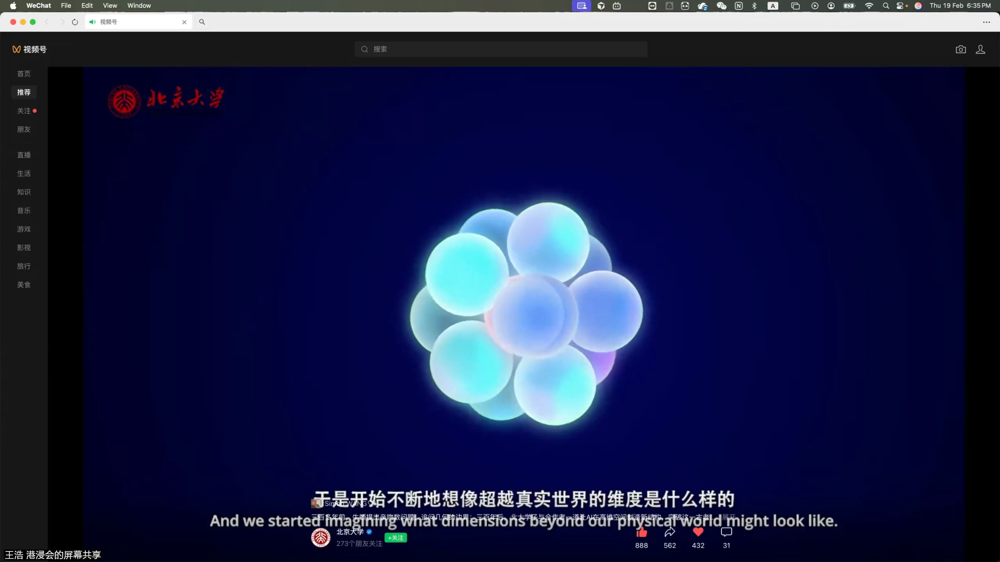

**屏幕可见UI元素** (OCR):
```
Wechat | File | Edit | View | Window | Thu 19 Feb 6:35PM | 视频号 | N 视频号 | 搜索 | 推荐 | 关注 | 朋友 | 生活 | 知识 | 音乐 | 游戏 | 影视 | 旅行 | 美食 | 北京大学
```

**讲师讲解要点**:
- [00:00:13] 于是开始不断的想象，超越真实世界的维度是什么样的
- [00:00:13] 我们仿佛有了能力去创造一个新的数字生命
- [00:00:13] 在三维空间中，你可以想象一个16它是一个多面积的石榴子，排在一起，把石榴子换成圆球，最多可以有多少个单位球和它相接，那就变成了300多年前牛顿提出来的问题
- [00:00:13] 当时牛顿认为应该贴12个

---

### 帧 3 [00:39]

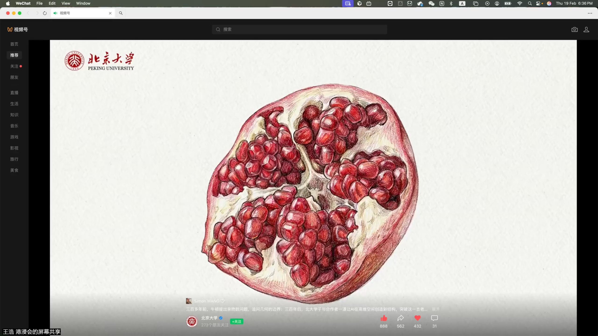

**屏幕可见UI元素** (OCR):
```
Wechat | File | Edit | View | Window | 令Q % | Thu 19 Feb 6:36PM | 视频号 | 搜索 | 推荐 | 关注 | 朋友 | 生活 | 知识 | 音乐 | 游戏 | 影视 | 旅行 | 美食 | 古老
```

**讲师讲解要点**:
- [00:00:13] 于是开始不断的想象，超越真实世界的维度是什么样的
- [00:00:13] 我们仿佛有了能力去创造一个新的数字生命
- [00:00:13] 在三维空间中，你可以想象一个16它是一个多面积的石榴子，排在一起，把石榴子换成圆球，最多可以有多少个单位球和它相接，那就变成了300多年前牛顿提出来的问题
- [00:00:13] 当时牛顿认为应该贴12个
- [00:01:03] 1900年的时候，希尔伯特在巴黎国际数学家大会上正式提出了23个问题，这些问题指引了后世数学研究的重要方向
- [00:01:03] 其中第18个问题的核心之一就是 key number 问题
- [00:01:03] 这个问题呢，其实非常简洁，但又非常深刻
- [00:01:03] 同时有很多的应用价值，在信息编码中，你想用最少的比特数来压缩最多的信息，这就是 case number 问题

---

### 帧 4 [00:59]

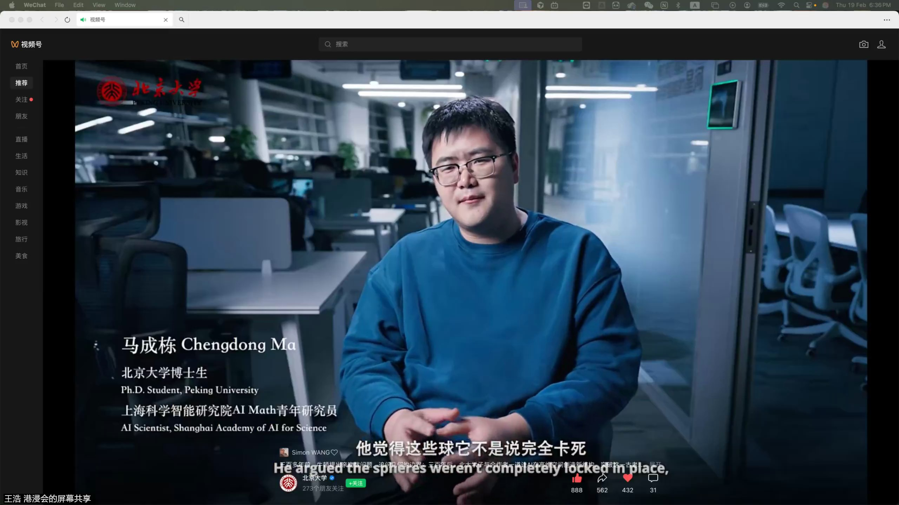

**屏幕可见UI元素** (OCR):
```
Wechat | Fille | Edit | Window | Thu 19 Feb 6.36PM | 视频号 | N 视频号 | Q 搜索 | 推荐 | 关注 | 朋友 | 直播 | 生活 | 知识 | 音乐 | 游戏 | 影视 | 旅行 | 美食 | 马成栋 Chengdong Ma
```

**屏幕文本内容** (OCR):
- Ph.D. Student; Peking University
- AI Scientist Shanghai Academy Of AI for Science

**讲师讲解要点**:
- [00:01:03] 1900年的时候，希尔伯特在巴黎国际数学家大会上正式提出了23个问题，这些问题指引了后世数学研究的重要方向
- [00:01:03] 其中第18个问题的核心之一就是 key number 问题
- [00:01:03] 这个问题呢，其实非常简洁，但又非常深刻
- [00:01:03] 同时有很多的应用价值，在信息编码中，你想用最少的比特数来压缩最多的信息，这就是 case number 问题

---

### 帧 5 [01:19]

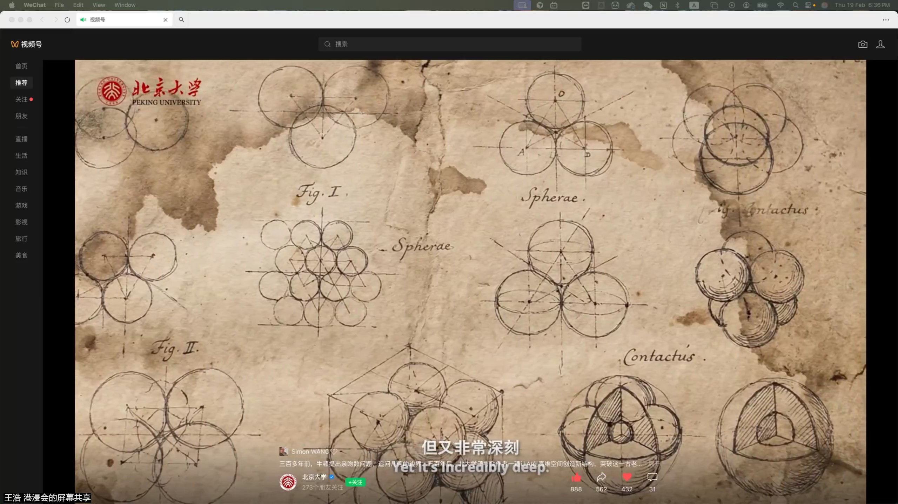

**屏幕可见UI元素** (OCR):
```
Wechat | Fille | Edit | Thu 19 Feb 6.36PM | Q 搜索 | 推荐 | 关注 | 朋友 | 直擂 | 生活 | 知识 | 音乐 | Jpkerae | 游戏 | 影视 | 旅行 | 美食 | Spierae | (ontactus | 但叉非常深刻
```

**讲师讲解要点**:
- [00:01:03] 1900年的时候，希尔伯特在巴黎国际数学家大会上正式提出了23个问题，这些问题指引了后世数学研究的重要方向
- [00:01:03] 其中第18个问题的核心之一就是 key number 问题
- [00:01:03] 这个问题呢，其实非常简洁，但又非常深刻
- [00:01:03] 同时有很多的应用价值，在信息编码中，你想用最少的比特数来压缩最多的信息，这就是 case number 问题
- [00:01:48] 当我们聊到2022年菲尔兹奖，由数学家取得一些特殊维度上的装求问题突破的过程中，我们就在思考，除了数学家从数学的角度在某些维度上的突破，我们能否把课题组前期在多智能体学习，强化学习上的成功带到数学领域。

---

### 帧 6 [01:39]

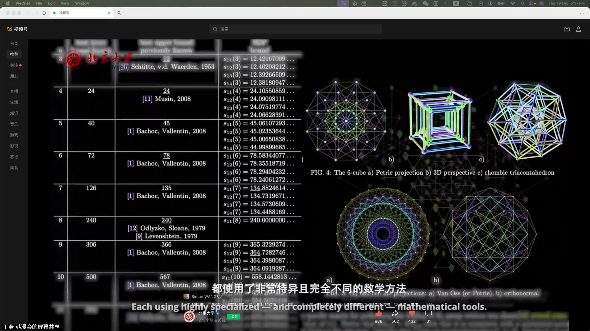

**屏幕可见UI元素** (OCR):
```
Wechat | Fille | Edit | Vew | Window | Thu 19 Feb 6.37PM | 搜索 | bol | 推荐 | 511(3) | 12.42167009 | 关注 | 812(3) | 12.40203212 | 朋友 | 813(3) | 12.39266509 | 814(3) | 12.38180947 | 24
```

**屏幕文本内容** (OCR):
- Petrie projection b) 3D perspective c) rhombic triacontahedron

**讲师讲解要点**:
- [00:01:48] 当我们聊到2022年菲尔兹奖，由数学家取得一些特殊维度上的装求问题突破的过程中，我们就在思考，除了数学家从数学的角度在某些维度上的突破，我们能否把课题组前期在多智能体学习，强化学习上的成功带到数学领域。
- [00:02:05] 真正的能够让人类在基础数学问题上有一些新的认知，新的发现数学问题并没有大量的训练数据，那这个呢和利用大量的已知的蛋白质的结构训练一个人工智能模型来预测新的蛋白质结构是不一样的，某种角度是无中生有的过程。

---

### 帧 7 [01:59]

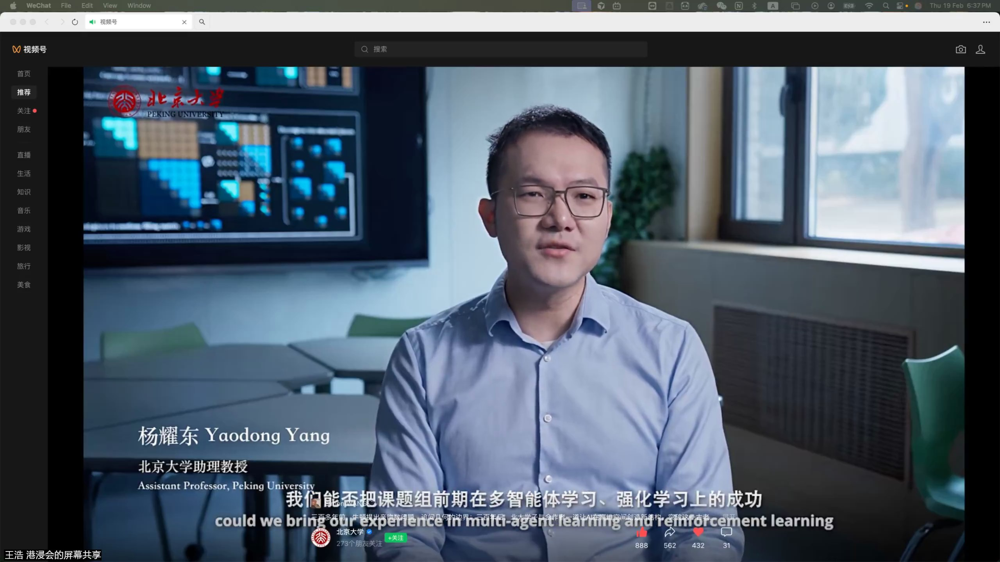

**屏幕可见UI元素** (OCR):
```
Wechat | Fille | Edit | Vew | Window | Thu 19 Feb 6.37PM | 视频号 | N 视频号 | 搜索 | 推荐 | 关注 | 朋友 | 直播 | 生活 | 知识 | 音乐 | 游戏 | 影视 | 旅行 | 美食
```

**屏幕文本内容** (OCR):
- Assistant Professor, Peking Universit

**讲师讲解要点**:
- [00:01:48] 当我们聊到2022年菲尔兹奖，由数学家取得一些特殊维度上的装求问题突破的过程中，我们就在思考，除了数学家从数学的角度在某些维度上的突破，我们能否把课题组前期在多智能体学习，强化学习上的成功带到数学领域。
- [00:02:05] 真正的能够让人类在基础数学问题上有一些新的认知，新的发现数学问题并没有大量的训练数据，那这个呢和利用大量的已知的蛋白质的结构训练一个人工智能模型来预测新的蛋白质结构是不一样的，某种角度是无中生有的过程。
- [00:02:28] 我们需要保证两点都互相都不接触，主要尽可能多。第一种我先保证他不接触，然后我再尝试一点点放弃了。第二种是我先保证的数量尽可能多，然后我再把它变得不接触。我一开始是对于现有的一些结构寻找其中的规律，当时最主要的就是基于 lattice 方法构造的，还有基于 error correction code。

---

### 帧 8 [02:19]

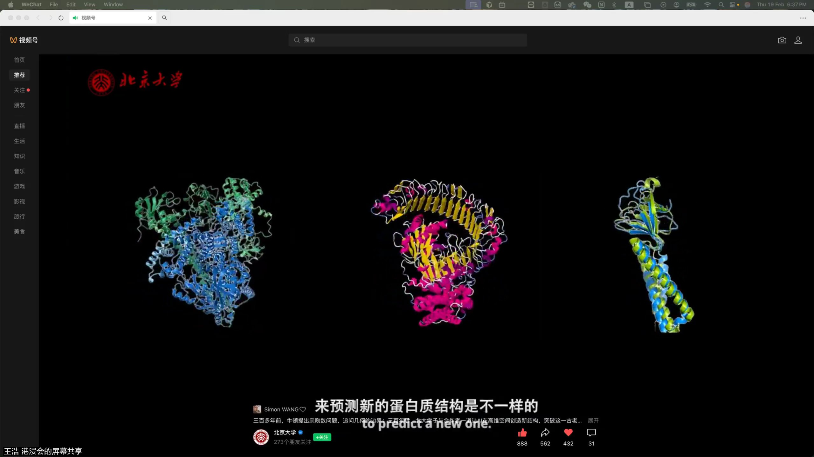

**屏幕可见UI元素** (OCR):
```
WeChat | File | Edit | Window | Thu 19 Feb 6:37PM | 视频号 | Q 搜索 | 推荐 | 关注 | 朋友 | 生活 | 知识 | 音乐 | 游戏 | 影视 | 旅行 | 美食 | Simon WANGO | 来预测新的蛋白质结构是不一样的 | 三百多年前。牛顿提出亲吻数问题;
```

**讲师讲解要点**:
- [00:02:05] 真正的能够让人类在基础数学问题上有一些新的认知，新的发现数学问题并没有大量的训练数据，那这个呢和利用大量的已知的蛋白质的结构训练一个人工智能模型来预测新的蛋白质结构是不一样的，某种角度是无中生有的过程。
- [00:02:28] 我们需要保证两点都互相都不接触，主要尽可能多。第一种我先保证他不接触，然后我再尝试一点点放弃了。第二种是我先保证的数量尽可能多，然后我再把它变得不接触。我一开始是对于现有的一些结构寻找其中的规律，当时最主要的就是基于 lattice 方法构造的，还有基于 error correction code。
- [00:02:56] 我们采取了跟数学家完全不同的思路，从最基本的约束和前提出发，接下一个球可以放在哪个位置，相当于就是把填空题变成了选择题。之前我们发现连四维都搞不定，一下子八维以下全部都被搞定了。然后后来很快我们发现，不管再怎么样优化这个方案，它都有一些注定无法被解决的限制，比如说舒适精度上的问题，误差会随着球数越来越多不断的传播累积，以至于误差本身都足以破坏整个堆积结构。

---

### 帧 9 [02:39]

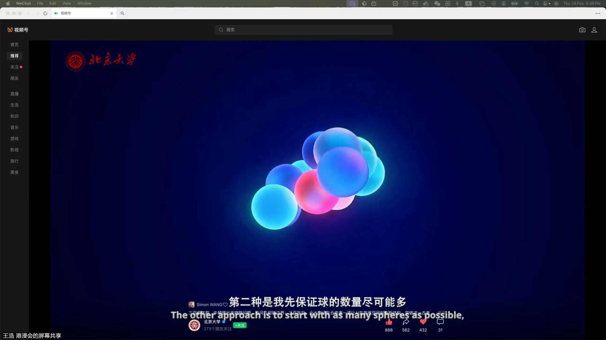

**屏幕可见UI元素** (OCR):
```
WeChat | File | Edit | Vew | Window | Thu 19 Feb 6:38PM | N 视频号 | Q 搜索 | 推荐 | 关注 | 朋友 | 生活 | 知识 | 音乐 | 游戏 | 影视 | 旅行 | 美食 | Simon WANG | 第二种是我先保证球的数量尽可能多
```

**讲师讲解要点**:
- [00:02:28] 我们需要保证两点都互相都不接触，主要尽可能多。第一种我先保证他不接触，然后我再尝试一点点放弃了。第二种是我先保证的数量尽可能多，然后我再把它变得不接触。我一开始是对于现有的一些结构寻找其中的规律，当时最主要的就是基于 lattice 方法构造的，还有基于 error correction code。
- [00:02:56] 我们采取了跟数学家完全不同的思路，从最基本的约束和前提出发，接下一个球可以放在哪个位置，相当于就是把填空题变成了选择题。之前我们发现连四维都搞不定，一下子八维以下全部都被搞定了。然后后来很快我们发现，不管再怎么样优化这个方案，它都有一些注定无法被解决的限制，比如说舒适精度上的问题，误差会随着球数越来越多不断的传播累积，以至于误差本身都足以破坏整个堆积结构。

---

### 帧 10 [03:19]

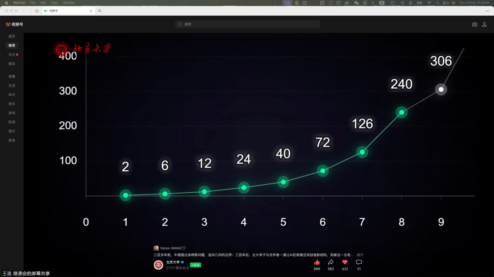

**屏幕可见UI元素** (OCR):
```
WeChat | File | Edit | Wingow | Thu 19 Feb 6:38PM | 视频号 | Q 搜索 | 推荐 | 关注 | 朋友 | 306 | 生活 | 240 | 知识 | 300 | 音乐 | 游戏 | 影视 | 200 | 126
```

**屏幕文本内容** (OCR):
- 三百多年前。牛顿提出亲吻数问题。追问几何的边界;  三百年后,北大学子与合作者一道让A1在高维空间创造新结构。突破这一古老。

**讲师讲解要点**:
- [00:02:56] 我们采取了跟数学家完全不同的思路，从最基本的约束和前提出发，接下一个球可以放在哪个位置，相当于就是把填空题变成了选择题。之前我们发现连四维都搞不定，一下子八维以下全部都被搞定了。然后后来很快我们发现，不管再怎么样优化这个方案，它都有一些注定无法被解决的限制，比如说舒适精度上的问题，误差会随着球数越来越多不断的传播累积，以至于误差本身都足以破坏整个堆积结构。
- [00:03:28] 我们被困在了九围八围这个附近，再高根本是完全没有办法再达到了
- [00:03:28] 在一个球面上有这样两个球的时候，他们在原点之间就形成了一个连线，两两之间都可以计算一个角度的余弦值
- [00:03:28] 这个余弦值并不是一个没有规矩的存在
- [00:03:28] 他们其实在一个有限的集合里，我们就不只是把整个坐标空间变成一个第三选择题，我们可以把每一个 cos 值也变成一个选择

---

### 帧 11 [03:39]

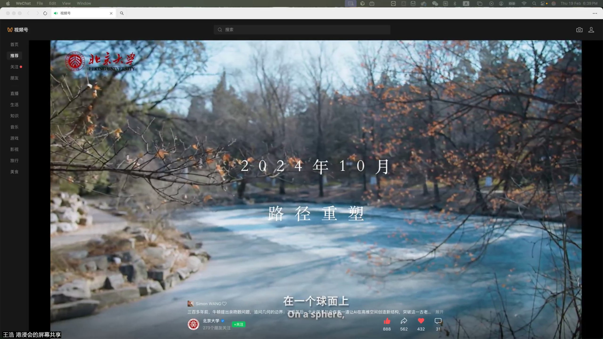

**屏幕可见UI元素** (OCR):
```
WeChat | File | Edit | Window | Thu 19 Feb 6:39PM | 视频号 | N 视频号 | Q 搜索 | 推荐 | 关注 | 朋友 | 直插 | 生活 | 知识 | 音乐 | 游戏 | 影视 | 旅行 | 美食 | 20 2 4年10月
```

**讲师讲解要点**:
- [00:03:28] 我们被困在了九围八围这个附近，再高根本是完全没有办法再达到了
- [00:03:28] 在一个球面上有这样两个球的时候，他们在原点之间就形成了一个连线，两两之间都可以计算一个角度的余弦值
- [00:03:28] 这个余弦值并不是一个没有规矩的存在
- [00:03:28] 他们其实在一个有限的集合里，我们就不只是把整个坐标空间变成一个第三选择题，我们可以把每一个 cos 值也变成一个选择

---

### 帧 12 [03:59]

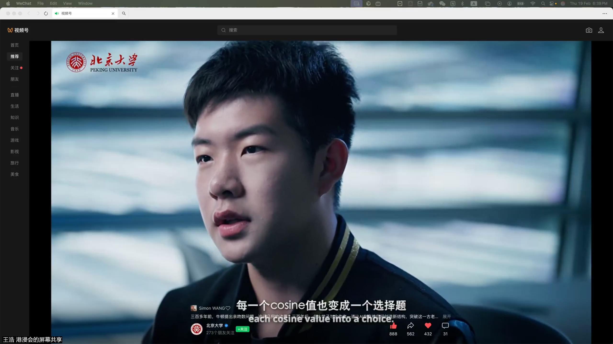

**屏幕可见UI元素** (OCR):
```
WeChat | File | Edit | Window | Thu 19 Feb 6:39PM | 视频号 | N 视频号 | Q 搜索 | 推荐 | 关注 | 朋友 | 生活 | 知识 | 音乐 | 游戏 | 影视 | 旅行 | 美食 | Simon WANGO | 每一个cosine值也娈成一个选择题
```

---

### 帧 13 [04:19]

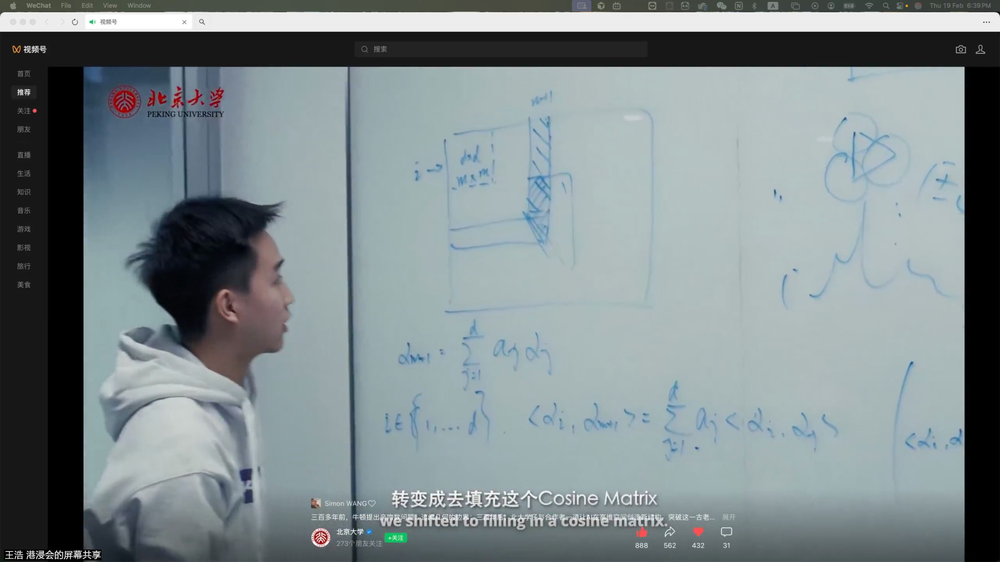

**屏幕可见UI元素** (OCR):
```
WeChat | File | Edit | Window | Thu 19 Feb 6:39PM | 视频号 | M 视频号 | Q 搜索 | 推荐 | 关注 | PKING UNIVLRSITY | 朋友 | 生活 | 知识 | 音乐 | 游戏 | 影视 | 旅行 | 美食 | Ol
```

**讲师讲解要点**:
- [00:04:50] 我们仍然需要寻找到最高效的学习算法。我们的思路是把它设计成一个游戏，用强化学习来训练智能题去玩这个游戏。它在每一步都需要从待选的动作集合中去选取一个条目来填充这个矩阵，直到整个矩阵无法再被填充。这个游戏就结束了，我们根据当前矩阵大小来对智能体进行奖励，那么这个问题的属性呢？我们认为就非常适合使用强化学习来求解，因为强化学习本来就是要在解决在高维空间中如何学出一组最优的策略来使得某个奖励函数最大化。

---

### 帧 14 [04:39]

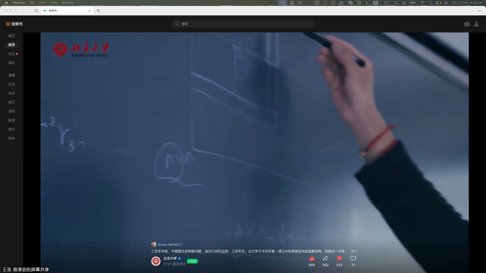

**屏幕可见UI元素** (OCR):
```
WeChat | File | Edit | Window | Thu 19 Feb 6.40PM | 视频号 | N 视频号 | Q 搜索 | 推荐 | 关注 | 朋友 | 生活 | 知识 | 音乐 | 游戏 | 影视 | 旅行 | 美食 | Simon WANGO | 展开
```

**屏幕文本内容** (OCR):
- 三百多年前。牛顿提出亲吻数问题。追问几何的边界;  三百年后。北大学子与合作者一道让A1在高维空间创造新结构。突破这一古老。

**讲师讲解要点**:
- [00:04:50] 我们仍然需要寻找到最高效的学习算法。我们的思路是把它设计成一个游戏，用强化学习来训练智能题去玩这个游戏。它在每一步都需要从待选的动作集合中去选取一个条目来填充这个矩阵，直到整个矩阵无法再被填充。这个游戏就结束了，我们根据当前矩阵大小来对智能体进行奖励，那么这个问题的属性呢？我们认为就非常适合使用强化学习来求解，因为强化学习本来就是要在解决在高维空间中如何学出一组最优的策略来使得某个奖励函数最大化。

---

### 帧 15 [04:59]

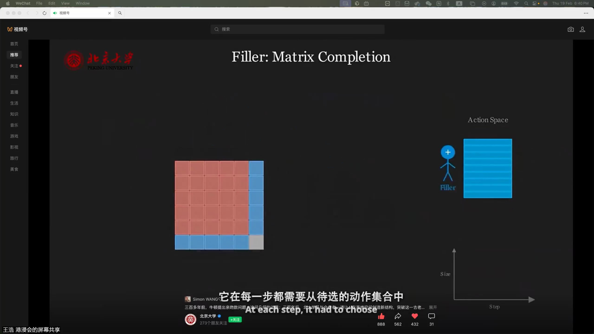

**屏幕可见UI元素** (OCR):
```
WeChat | File | Edit | Window | Thu 19 Feb 6-40PM | 视频号 | N 视频号 | 搜索 | 推荐 | Filler: Matrix Completion | 关注 | 朋友 | 生活 | 知识 | Action Space | 音乐 | 游戏 | 影视 | 旅行 | 美食
```

**讲师讲解要点**:
- [00:04:50] 我们仍然需要寻找到最高效的学习算法。我们的思路是把它设计成一个游戏，用强化学习来训练智能题去玩这个游戏。它在每一步都需要从待选的动作集合中去选取一个条目来填充这个矩阵，直到整个矩阵无法再被填充。这个游戏就结束了，我们根据当前矩阵大小来对智能体进行奖励，那么这个问题的属性呢？我们认为就非常适合使用强化学习来求解，因为强化学习本来就是要在解决在高维空间中如何学出一组最优的策略来使得某个奖励函数最大化。
- [00:05:25] 加球这件事，它不像下围棋无所谓顺序性，比如我们按照 ABC 的顺序去加和按照 BCA 顺序去加，会得到完全相同的结构
- [00:05:25] 我们需要避免重复探索已经走过的轨迹，从海量备选中批量的剔除几何同构的情况，否则会严重影响轨迹的多样性，以及我们 AI 探索的效率，最终导致难以学出好的策略
- [00:05:25] 有时候也不一定是非常精细化的一条一条去加
- [00:05:25] 一些情况下，我们允许一次加多个矩阵条目，这会大幅度优化轨迹分布，从而提高 AI 与环境交互时的试错效率，高效的调控家球的精细程度

---

### 帧 16 [05:19]

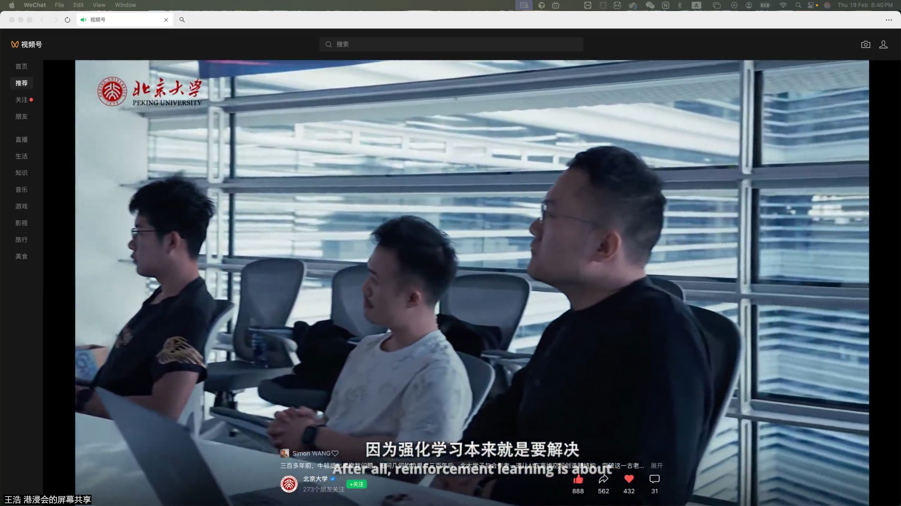

**屏幕可见UI元素** (OCR):
```
WeChat | File | Edit | Window | Thu 19 Feb 6.40PM | 视频号 | M 视频号 | Q 搜索 | 首页 | 推荐 | 关注 | 朋友 | 生活 | 知识 | 音乐 | 游戏 | 影视 | 旅行 | 美食 | Simon WANGO
```

**讲师讲解要点**:
- [00:04:50] 我们仍然需要寻找到最高效的学习算法。我们的思路是把它设计成一个游戏，用强化学习来训练智能题去玩这个游戏。它在每一步都需要从待选的动作集合中去选取一个条目来填充这个矩阵，直到整个矩阵无法再被填充。这个游戏就结束了，我们根据当前矩阵大小来对智能体进行奖励，那么这个问题的属性呢？我们认为就非常适合使用强化学习来求解，因为强化学习本来就是要在解决在高维空间中如何学出一组最优的策略来使得某个奖励函数最大化。
- [00:05:25] 加球这件事，它不像下围棋无所谓顺序性，比如我们按照 ABC 的顺序去加和按照 BCA 顺序去加，会得到完全相同的结构
- [00:05:25] 我们需要避免重复探索已经走过的轨迹，从海量备选中批量的剔除几何同构的情况，否则会严重影响轨迹的多样性，以及我们 AI 探索的效率，最终导致难以学出好的策略
- [00:05:25] 有时候也不一定是非常精细化的一条一条去加
- [00:05:25] 一些情况下，我们允许一次加多个矩阵条目，这会大幅度优化轨迹分布，从而提高 AI 与环境交互时的试错效率，高效的调控家球的精细程度

---

### 帧 17 [05:39]

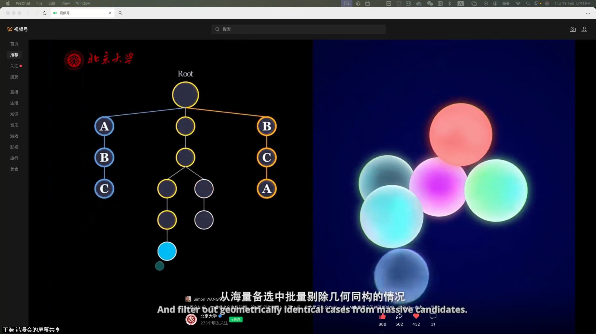

**屏幕可见UI元素** (OCR):
```
WeChat | File | Edit | Window | Thu 19 Feb 6.41PM | N 视频号 | Q  搜索 | 推荐 | 关注 | 朋友 | Root | 直播 | 生活 | 知识 | 音乐 | 游戏 | 影视 | 旅行 | 美食 | Simon WANG
```

**讲师讲解要点**:
- [00:05:25] 加球这件事，它不像下围棋无所谓顺序性，比如我们按照 ABC 的顺序去加和按照 BCA 顺序去加，会得到完全相同的结构
- [00:05:25] 我们需要避免重复探索已经走过的轨迹，从海量备选中批量的剔除几何同构的情况，否则会严重影响轨迹的多样性，以及我们 AI 探索的效率，最终导致难以学出好的策略
- [00:05:25] 有时候也不一定是非常精细化的一条一条去加
- [00:05:25] 一些情况下，我们允许一次加多个矩阵条目，这会大幅度优化轨迹分布，从而提高 AI 与环境交互时的试错效率，高效的调控家球的精细程度

---

### 帧 18 [05:59]

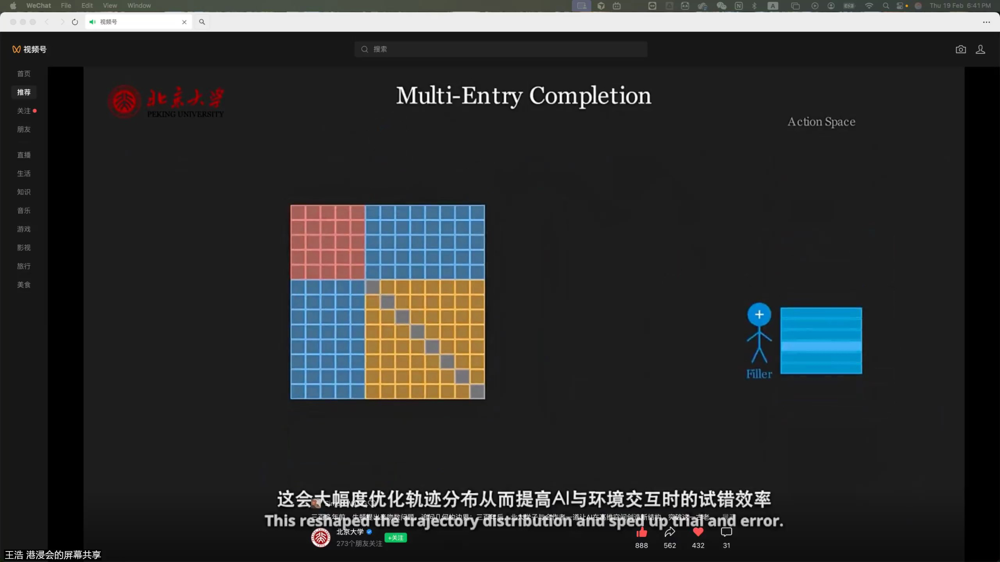

**屏幕可见UI元素** (OCR):
```
WeChat | File | Edit | Window | Thu 19 Feb 6.41PM | 视频号 | N 视频号 | 搜索 | 推荐 | Multi-Entry Completion | 关注 | Action Space | 朋友 | 生活 | 知识 | 音乐 | 游戏 | 影视 | 旅行 | 美食
```

---

### 帧 19 [06:19]

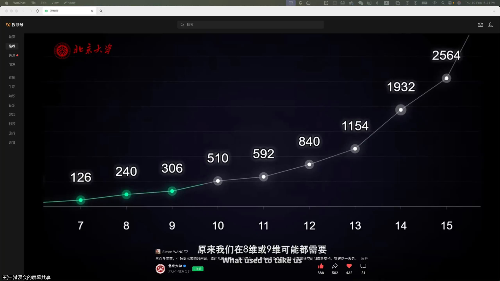

**屏幕可见UI元素** (OCR):
```
WeChat | File | Edit | Window | Thu 19 Feb 6.41PM | 视频号 | Q 搜索 | 推荐 | 关注 | 2564 | 朋友 | 生活 | 1932 | 知识 | 音乐 | 游戏 | 影视 | 1154 | 旅行 | 美食
```

**讲师讲解要点**:
- [00:06:52] 数学的发现，工程上的精兵强将和他们在一起来理解这程序里边哪些最关键的算子在这一起来进行相关的优化，这个呢是非常非常重要的一步
- [00:06:52] 计算跟智能是密不可分的
- [00:06:52] 假如我有一套方法能快速的搜索出所有的答案
- [00:06:52] 其实我就是最聪明的人，假如我们提升了搜索速度好几倍，这就意味着原来三年的工作现在变成一年的一个工作，最开始其实直接调了一些原生扩大，有的算子发现大量的通信是从 GPU 给读到 CPU 的计算，所以我们要重新开发一

---

### 帧 20 [06:39]

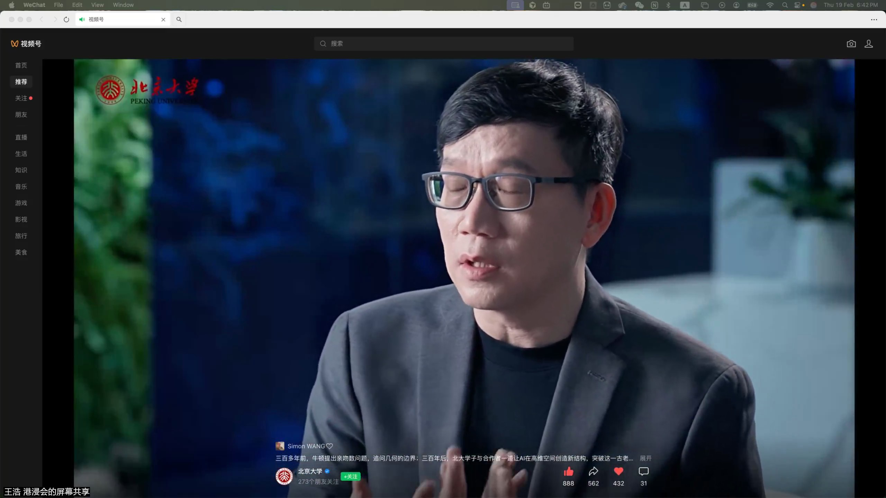

**屏幕可见UI元素** (OCR):
```
WeChat | File | Edit | Window | Thu 19 Feb 6.42PM | 视频号 | N 视频号 | Q 搜索 | 推荐 | 关注 | 朋友 | 直播 | 生活 | 知识 | 音乐 | 游戏 | 影视 | 旅行 | 美食 | Simon WANGO
```

**屏幕文本内容** (OCR):
- 三百多年前。牛顿提出亲吻数问题。追问几何的边界;  三百年后

**讲师讲解要点**:
- [00:06:52] 数学的发现，工程上的精兵强将和他们在一起来理解这程序里边哪些最关键的算子在这一起来进行相关的优化，这个呢是非常非常重要的一步
- [00:06:52] 计算跟智能是密不可分的
- [00:06:52] 假如我有一套方法能快速的搜索出所有的答案
- [00:06:52] 其实我就是最聪明的人，假如我们提升了搜索速度好几倍，这就意味着原来三年的工作现在变成一年的一个工作，最开始其实直接调了一些原生扩大，有的算子发现大量的通信是从 GPU 给读到 CPU 的计算，所以我们要重新开发一

---

### 帧 21 [06:59]

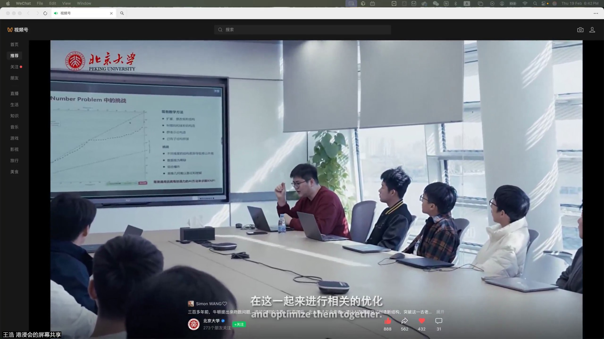

**屏幕可见UI元素** (OCR):
```
WeChat | File | Edit | Window | Thu 19 Feb 6.42PM | 视频号 | N 视频号 | Q 搜索 | 推荐 | 关注 | 朋友 | Number Problem 中的挑战 | 生活 | 知识 | 音乐 | 游戏 | 影视 | 旅行 | 美食 | Simon WANGO
```

**讲师讲解要点**:
- [00:06:52] 数学的发现，工程上的精兵强将和他们在一起来理解这程序里边哪些最关键的算子在这一起来进行相关的优化，这个呢是非常非常重要的一步
- [00:06:52] 计算跟智能是密不可分的
- [00:06:52] 假如我有一套方法能快速的搜索出所有的答案
- [00:06:52] 其实我就是最聪明的人，假如我们提升了搜索速度好几倍，这就意味着原来三年的工作现在变成一年的一个工作，最开始其实直接调了一些原生扩大，有的算子发现大量的通信是从 GPU 给读到 CPU 的计算，所以我们要重新开发一

---

### 帧 22 [07:19]

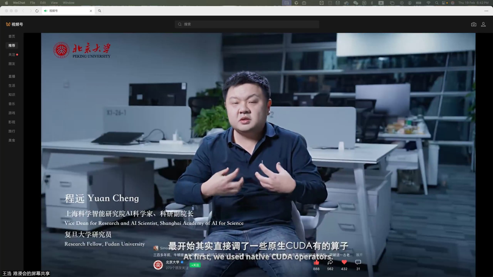

**屏幕可见UI元素** (OCR):
```
WeChat | File | Edit | Window | Thu 19 Feb 6.42PM | N 视频号 | Q 搜索 | 推荐 | 关注 | 朋友 | 直播 | 生活 | 知识 | 音乐 | 游戏 | 影视 | 旅行 | 美食 | 程远 Yuan Cheng | 复旦大学研究员
```

**屏幕文本内容** (OCR):
- Vice Dean for Rescarch and AI Scientist; Shanghai Academy 0f AI for Science
- Rescarch Fellow, Fudan Universit

**讲师讲解要点**:
- [00:06:52] 数学的发现，工程上的精兵强将和他们在一起来理解这程序里边哪些最关键的算子在这一起来进行相关的优化，这个呢是非常非常重要的一步
- [00:06:52] 计算跟智能是密不可分的
- [00:06:52] 假如我有一套方法能快速的搜索出所有的答案
- [00:06:52] 其实我就是最聪明的人，假如我们提升了搜索速度好几倍，这就意味着原来三年的工作现在变成一年的一个工作，最开始其实直接调了一些原生扩大，有的算子发现大量的通信是从 GPU 给读到 CPU 的计算，所以我们要重新开发一
- [00:07:43] 同步位置也调整一下，计算过程中有些操作对精度要求很高，有些则不需要那么高精度
- [00:07:43] 我们设计了混合精度机制去逼近每一个精度级别的极限，从而大幅度提高了计算效率以及预缓存一些关键信息
- [00:07:43] 之后就可以仅通过少量的计算，快速的调度查询，我们做的优化，讲起来理论也挺简单，每隔一段时间把当时的状态存下来，我随时有卡掉线，我重新根据上一个 checkpoint 来捞回来继续计算
- [00:07:43] 这样的话，我们其实一方面优化了计算效率，一方面提升了算力的规模，我们和工程师团队一起把所有的 for 循环都改成了可以并行计算的方式，这让程序的效率大幅提升，慢慢的程序可以扩展到15位，20位甚至30位以上

---

### 帧 23 [07:39]

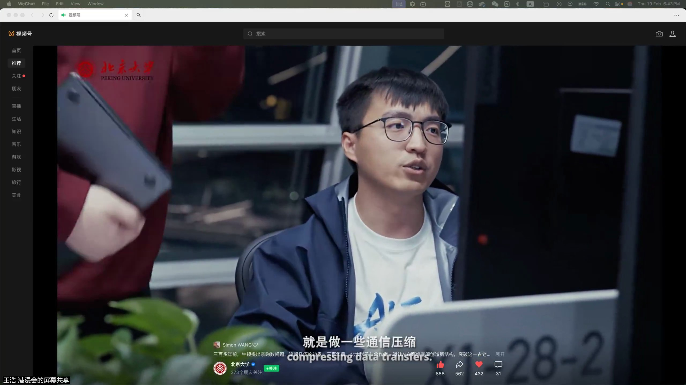

**屏幕可见UI元素** (OCR):
```
WeChat | File | Edit | Window | Thu 19 Feb 6.43PM | 视频号 | N 视频号 | Q 搜索 | 推荐 | 关注 | 朋友 | 直擂 | 生活 | 知识 | 音乐 | 游戏 | 影视 | 旅行 | 美食 | Simon WANGO
```

**讲师讲解要点**:
- [00:07:43] 同步位置也调整一下，计算过程中有些操作对精度要求很高，有些则不需要那么高精度
- [00:07:43] 我们设计了混合精度机制去逼近每一个精度级别的极限，从而大幅度提高了计算效率以及预缓存一些关键信息
- [00:07:43] 之后就可以仅通过少量的计算，快速的调度查询，我们做的优化，讲起来理论也挺简单，每隔一段时间把当时的状态存下来，我随时有卡掉线，我重新根据上一个 checkpoint 来捞回来继续计算
- [00:07:43] 这样的话，我们其实一方面优化了计算效率，一方面提升了算力的规模，我们和工程师团队一起把所有的 for 循环都改成了可以并行计算的方式，这让程序的效率大幅提升，慢慢的程序可以扩展到15位，20位甚至30位以上

---

### 帧 24 [07:59]

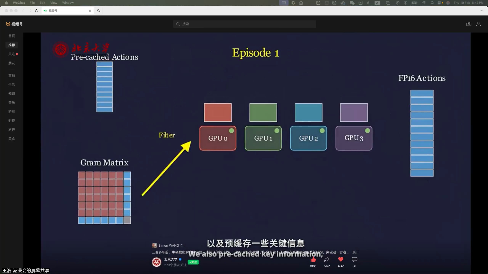

**屏幕可见UI元素** (OCR):
```
WeChat | File | Edit | Window | Thu 19 Feb 6.43PM | N 视频号 | Q 搜索 | 推荐 | 关注 | Eisode 1 | Pre cachea Actions | 朋友 | 直播 | 生活 | 知识 | 音乐 | 游戏 | 影视 | 旅行 | 美食
```

**讲师讲解要点**:
- [00:07:43] 同步位置也调整一下，计算过程中有些操作对精度要求很高，有些则不需要那么高精度
- [00:07:43] 我们设计了混合精度机制去逼近每一个精度级别的极限，从而大幅度提高了计算效率以及预缓存一些关键信息
- [00:07:43] 之后就可以仅通过少量的计算，快速的调度查询，我们做的优化，讲起来理论也挺简单，每隔一段时间把当时的状态存下来，我随时有卡掉线，我重新根据上一个 checkpoint 来捞回来继续计算
- [00:07:43] 这样的话，我们其实一方面优化了计算效率，一方面提升了算力的规模，我们和工程师团队一起把所有的 for 循环都改成了可以并行计算的方式，这让程序的效率大幅提升，慢慢的程序可以扩展到15位，20位甚至30位以上

---

### 帧 25 [08:19]

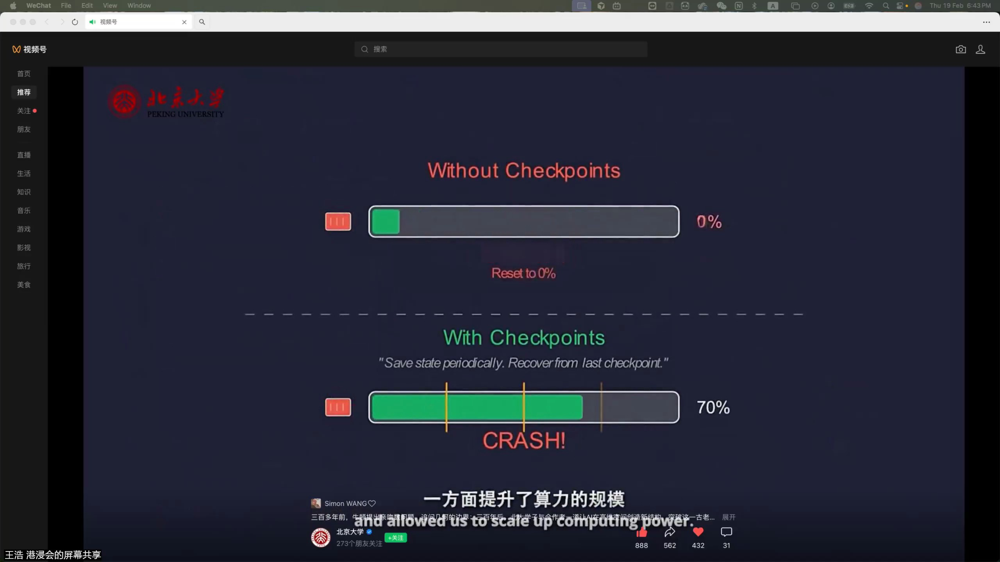

**屏幕可见UI元素** (OCR):
```
WeChat | File | Edit | Window | Thu 19 Feb 6.43PM | N 视频号 | Q 搜索 | 推荐 | 关注 | 朋友 | 生活 | Without Checkpoints | 知识 | 音乐 | 游戏 | 影视 | 旅行 | Reset to 09 | 美食 | With Checkpoints
```

**屏幕文本内容** (OCR):
- "Savestate periodically. Recoverfom last checkpoint

**讲师讲解要点**:
- [00:08:48] 但是随着进一步的实验以后就发现，虽然现在扩展能力上去了，但是实验上就是跑不出那个结果，当时遇到的最大问题就是14维，我们就是没有办法复原1932
- [00:08:48] 千百次数万次的实验之后全部都是失败的
- [00:08:48] 这个14位的1932就像一个梦魇一样，一直缠绕了半年多的时间
- [00:08:48] 我甚至会做梦，梦到有1700多，但是全部都是幻觉，这是我们唯一没有复现出来的数学家的结果

---

### 帧 26 [08:39]

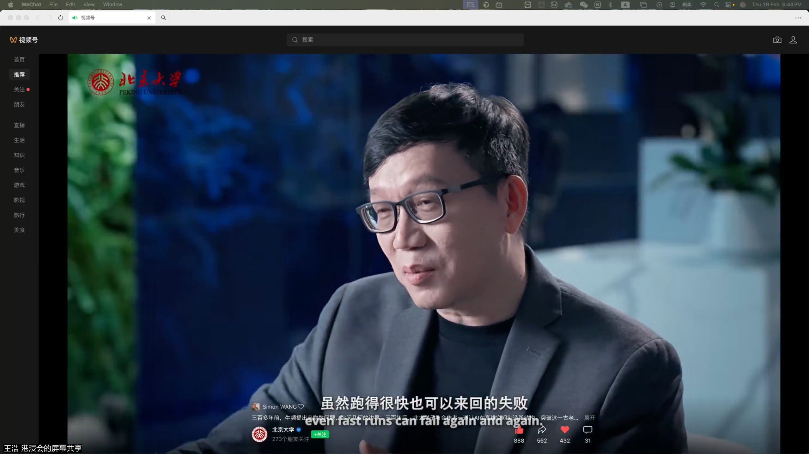

**屏幕可见UI元素** (OCR):
```
WeChat | File | Edit | Window | Thu 19 Feb 6.44PM | 视频号 | N 视频号 | Q 搜索 | 推荐 | 关注 | 朋友 | 生活 | 知识 | 音乐 | 游戏 | 影视 | 旅行 | 美食 | Simon WANGO | 虽然跑得很快也可以来回的失败
```

**讲师讲解要点**:
- [00:08:48] 但是随着进一步的实验以后就发现，虽然现在扩展能力上去了，但是实验上就是跑不出那个结果，当时遇到的最大问题就是14维，我们就是没有办法复原1932
- [00:08:48] 千百次数万次的实验之后全部都是失败的
- [00:08:48] 这个14位的1932就像一个梦魇一样，一直缠绕了半年多的时间
- [00:08:48] 我甚至会做梦，梦到有1700多，但是全部都是幻觉，这是我们唯一没有复现出来的数学家的结果

---

### 帧 27 [08:59]

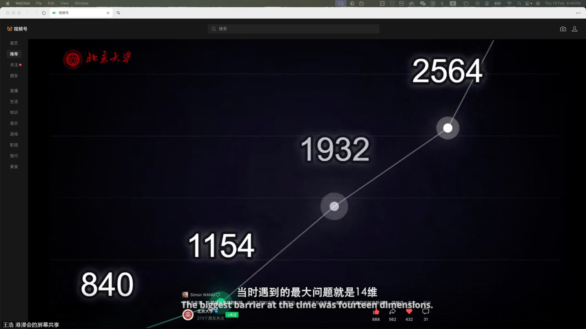

**屏幕可见UI元素** (OCR):
```
WeChat | File | Edit | Window | Thu 19 Feb 6.44PM | 视频号 | M 视频号 | Q 搜索 | 推荐 | 关注 | 朋友 | 2564 | 直播 | 生活 | 知识 | 音乐 | 游戏 | 影视 | 旅行 | 1932
```

**讲师讲解要点**:
- [00:08:48] 但是随着进一步的实验以后就发现，虽然现在扩展能力上去了，但是实验上就是跑不出那个结果，当时遇到的最大问题就是14维，我们就是没有办法复原1932
- [00:08:48] 千百次数万次的实验之后全部都是失败的
- [00:08:48] 这个14位的1932就像一个梦魇一样，一直缠绕了半年多的时间
- [00:08:48] 我甚至会做梦，梦到有1700多，但是全部都是幻觉，这是我们唯一没有复现出来的数学家的结果
- [00:09:35] 我经常问成栋说，我们是否跑出了已知的结果，是否突破了 lower band 的，虽然有压力，但是这个事情本身的价值非常高，值得投入，它比如很高的数学价值
- [00:09:35] 同时这些探索本身也会启迪新的人工智能的技术发展，尤其在搜索推理上的一些发展，所以我觉得这样的团队
- [00:09:35] 陈栋的思路就跟我们数学系的人很不一样，他的直觉对我来说虽然非常奇怪，但确实是互补的
- [00:09:35] 复原14维到最后的时候，我需要手动的删掉一些球，它就可以复原

---

### 帧 28 [09:19]

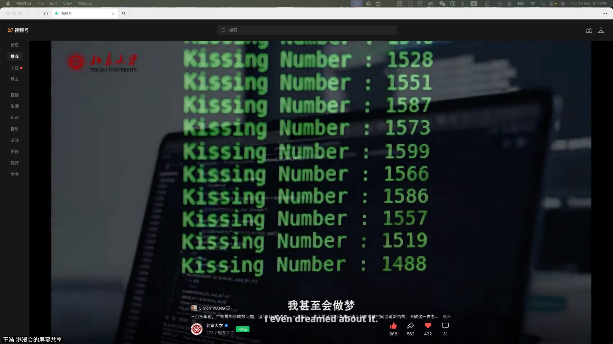

**屏幕可见UI元素** (OCR):
```
WeChat | File | Edit | Window | Thu 19 Feb 6.44PM | 视频号 | N 视频号 | 搜索 | 推荐 | 关注 | 1528 | 朋友 | Ksszng Number | 1551 | 生活 | Kissing Number | 1587 | 知识 | 音乐 | Kssing Number
```

**讲师讲解要点**:
- [00:09:35] 我经常问成栋说，我们是否跑出了已知的结果，是否突破了 lower band 的，虽然有压力，但是这个事情本身的价值非常高，值得投入，它比如很高的数学价值
- [00:09:35] 同时这些探索本身也会启迪新的人工智能的技术发展，尤其在搜索推理上的一些发展，所以我觉得这样的团队
- [00:09:35] 陈栋的思路就跟我们数学系的人很不一样，他的直觉对我来说虽然非常奇怪，但确实是互补的
- [00:09:35] 复原14维到最后的时候，我需要手动的删掉一些球，它就可以复原

---

### 帧 29 [09:39]

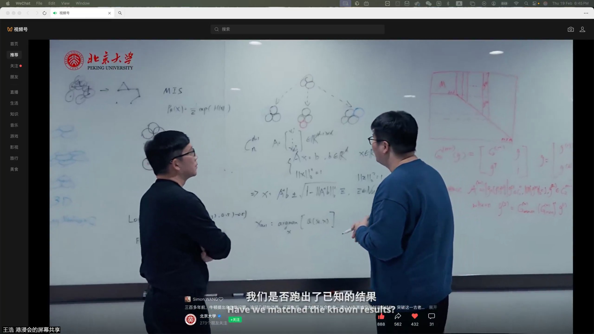

**屏幕可见UI元素** (OCR):
```
WeChat | File | Edit | Window | Thu 19 Feb 6.45PM | 视频号 | N 视频号 | Q 搜索 | 首页 | 推荐 | 关注 | 朋友 | NII $ | 生活 | 知识 | 音乐 | 游戏 | [}ekw | 影视 | 旅行
```

**讲师讲解要点**:
- [00:09:35] 我经常问成栋说，我们是否跑出了已知的结果，是否突破了 lower band 的，虽然有压力，但是这个事情本身的价值非常高，值得投入，它比如很高的数学价值
- [00:09:35] 同时这些探索本身也会启迪新的人工智能的技术发展，尤其在搜索推理上的一些发展，所以我觉得这样的团队
- [00:09:35] 陈栋的思路就跟我们数学系的人很不一样，他的直觉对我来说虽然非常奇怪，但确实是互补的
- [00:09:35] 复原14维到最后的时候，我需要手动的删掉一些球，它就可以复原

---

### 帧 30 [09:59]

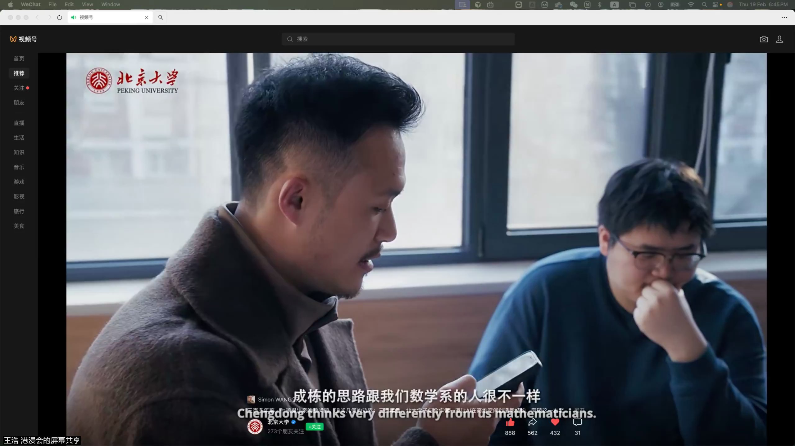

**屏幕可见UI元素** (OCR):
```
WeChat | File | Edit | Window | Thu 19 Feb 6.45PM | 视频号 | M 视频号 | Q 搜索 | 首页 | 推荐 | 关注 | 朋友 | 生活 | 知识 | 音乐 | 游戏 | 影视 | 旅行 | 美食 | Simon
```

**讲师讲解要点**:
- [00:09:35] 我经常问成栋说，我们是否跑出了已知的结果，是否突破了 lower band 的，虽然有压力，但是这个事情本身的价值非常高，值得投入，它比如很高的数学价值
- [00:09:35] 同时这些探索本身也会启迪新的人工智能的技术发展，尤其在搜索推理上的一些发展，所以我觉得这样的团队
- [00:09:35] 陈栋的思路就跟我们数学系的人很不一样，他的直觉对我来说虽然非常奇怪，但确实是互补的
- [00:09:35] 复原14维到最后的时候，我需要手动的删掉一些球，它就可以复原
- [00:10:37] 需要达成合作，通过合作博弈的方式来求解一个非常复杂的岗位空间的巡游问题，这也是这个工作最巧妙的地方，就是陈栋把一个稳求问题转化成了一个博弈问题，并且这个博弈
- [00:10:37] 问题可以用强化学习来调节 second player ，相当于为原本巨大且无序的高危空间添加了一种正则约束，从而显著的压缩的搜索空间，大幅度提高了我们的强化学习系统在价值估计和策略优化上的效率
- [00:10:37] 我们很快的实现了这个想法，立马就达到了14位的1932，我们已经可以完全的用我们的 AI 系统复现所有的这个结果了

---

### 帧 31 [10:19]

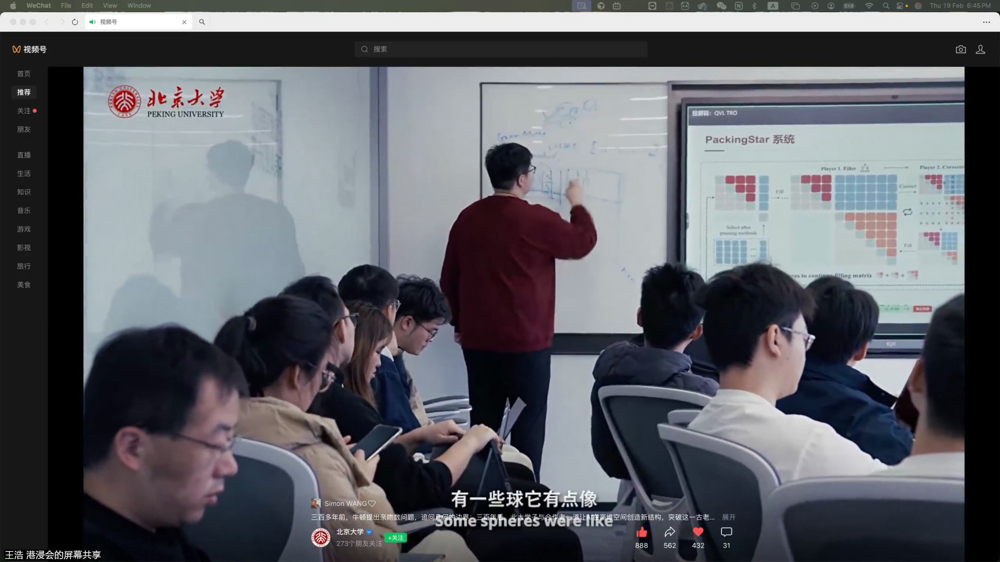

**屏幕可见UI元素** (OCR):
```
WeChat | File | Edit | Window | Thu 19 Feb 6.45PM | 视频号 | M 视频号 | Q 搜索 | 推荐 | 关注 | 朋友 | PackingStar 系统 | 直播 | 生活 | 知识 | 音乐 | 游戏 | 影视 | 旅行 | 美食
```

**讲师讲解要点**:
- [00:10:37] 需要达成合作，通过合作博弈的方式来求解一个非常复杂的岗位空间的巡游问题，这也是这个工作最巧妙的地方，就是陈栋把一个稳求问题转化成了一个博弈问题，并且这个博弈
- [00:10:37] 问题可以用强化学习来调节 second player ，相当于为原本巨大且无序的高危空间添加了一种正则约束，从而显著的压缩的搜索空间，大幅度提高了我们的强化学习系统在价值估计和策略优化上的效率
- [00:10:37] 我们很快的实现了这个想法，立马就达到了14位的1932，我们已经可以完全的用我们的 AI 系统复现所有的这个结果了

---

### 帧 32 [10:39]

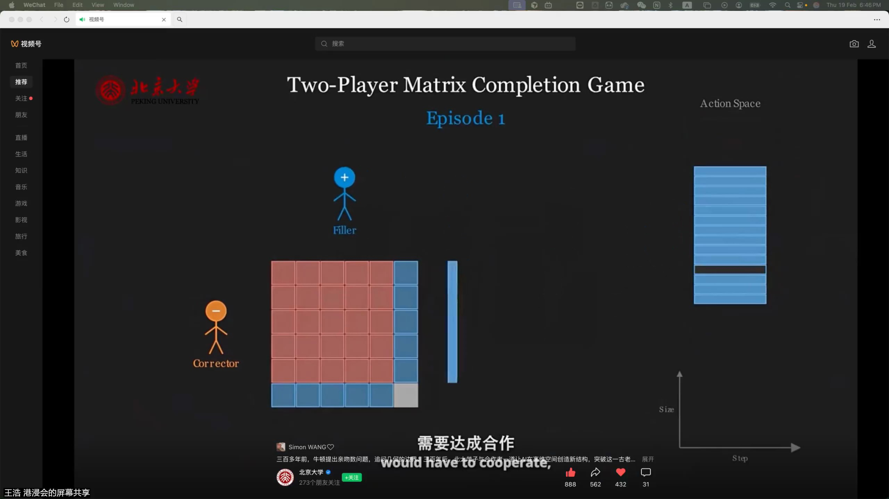

**屏幕可见UI元素** (OCR):
```
WeChat | File | Edit | VeN | Window | Thu 19 Feb 6.46PM | 视频号 | 搜索 | 推荐 | 关注 | Action Space | 朋友 | Eisode1 | 生活 | 知识 | 音乐 | 游戏 | 影视 | Filler | 旅行
```

**屏幕文本内容** (OCR):
- Two-Player Matrix Completion Game

**讲师讲解要点**:
- [00:10:37] 需要达成合作，通过合作博弈的方式来求解一个非常复杂的岗位空间的巡游问题，这也是这个工作最巧妙的地方，就是陈栋把一个稳求问题转化成了一个博弈问题，并且这个博弈
- [00:10:37] 问题可以用强化学习来调节 second player ，相当于为原本巨大且无序的高危空间添加了一种正则约束，从而显著的压缩的搜索空间，大幅度提高了我们的强化学习系统在价值估计和策略优化上的效率
- [00:10:37] 我们很快的实现了这个想法，立马就达到了14位的1932，我们已经可以完全的用我们的 AI 系统复现所有的这个结果了

---

### 帧 33 [10:59]

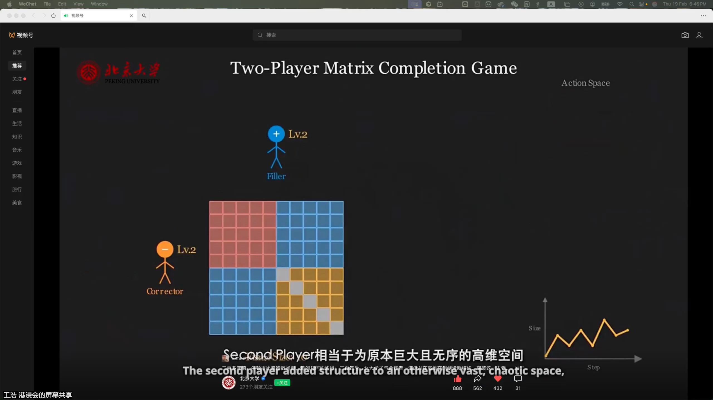

**屏幕可见UI元素** (OCR):
```
WeChat | File | Edit | VeN | Window | Thu 19 Feb 6.46PM | 视频号 | 搜索 | 推荐 | 关注 | Action Space | 朋友 | 生活 | 知识 | Lv2 | 音乐 | 游戏 | 影视 | 旅行 | 美食
```

**屏幕文本内容** (OCR):
- Two-Player Matrix Completion Game
- ecalaalsRlayer相当于为原本巨大且无序的高维空间

**讲师讲解要点**:
- [00:10:37] 需要达成合作，通过合作博弈的方式来求解一个非常复杂的岗位空间的巡游问题，这也是这个工作最巧妙的地方，就是陈栋把一个稳求问题转化成了一个博弈问题，并且这个博弈
- [00:10:37] 问题可以用强化学习来调节 second player ，相当于为原本巨大且无序的高危空间添加了一种正则约束，从而显著的压缩的搜索空间，大幅度提高了我们的强化学习系统在价值估计和策略优化上的效率
- [00:10:37] 我们很快的实现了这个想法，立马就达到了14位的1932，我们已经可以完全的用我们的 AI 系统复现所有的这个结果了
- [00:11:22] 其实是复制了或者达到了已知的最好的东西，我们要的是突破已知的边界，我们要发现以前没有的新结果，我们当时看见带球的物体会半两半，每个人排一个串排什么九九八十一次，看能不能给我们这个算法这个结构加一个球
- [00:11:22] 探索的这个未知事物本身就是 nature，其实在博弈论里面也有个东西叫 nature 这个 nature，就是把这个结构设计成天然的爆炸复杂度的这么个样式，但我们要做的就是在这个巨大的空间和迷宫中
- [00:11:22] 找到 nature 设计处的求解这个迷宫的出路
- [00:11:22] 当时我们几个就在西安那个江边散步

---

### 帧 34 [11:19]

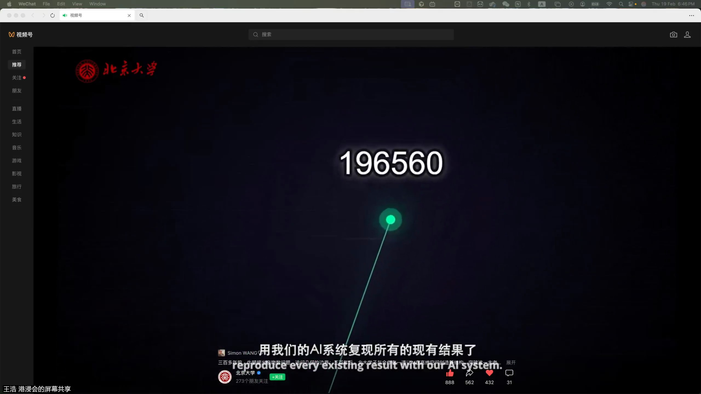

**屏幕可见UI元素** (OCR):
```
WeChat | File | Edit | VeN | Window | Thu 19 Feb 6.46PM | 视频号 | Q 搜索 | 推荐 | 关注 | 朋友 | 生活 | 知识 | 音乐 | 游戏 | 影视 | 196560 | 旅行 | 美食 | Simon WANG
```

**讲师讲解要点**:
- [00:11:22] 其实是复制了或者达到了已知的最好的东西，我们要的是突破已知的边界，我们要发现以前没有的新结果，我们当时看见带球的物体会半两半，每个人排一个串排什么九九八十一次，看能不能给我们这个算法这个结构加一个球
- [00:11:22] 探索的这个未知事物本身就是 nature，其实在博弈论里面也有个东西叫 nature 这个 nature，就是把这个结构设计成天然的爆炸复杂度的这么个样式，但我们要做的就是在这个巨大的空间和迷宫中
- [00:11:22] 找到 nature 设计处的求解这个迷宫的出路
- [00:11:22] 当时我们几个就在西安那个江边散步

---

### 帧 35 [11:39]

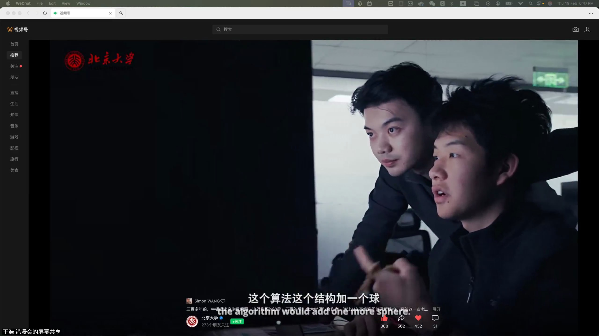

**屏幕可见UI元素** (OCR):
```
WeChat | File | Edit | Window | Thu 19 Feb 6.47PM | 视频号 | N 视频号 | Q 搜索 | 推荐 | 关注 | 朋友 | 生活 | 知识 | 音乐 | 游戏 | 影视 | 旅行 | 美食 | Simon WANGO | 这个算法这个结构加一个球
```

**讲师讲解要点**:
- [00:11:22] 其实是复制了或者达到了已知的最好的东西，我们要的是突破已知的边界，我们要发现以前没有的新结果，我们当时看见带球的物体会半两半，每个人排一个串排什么九九八十一次，看能不能给我们这个算法这个结构加一个球
- [00:11:22] 探索的这个未知事物本身就是 nature，其实在博弈论里面也有个东西叫 nature 这个 nature，就是把这个结构设计成天然的爆炸复杂度的这么个样式，但我们要做的就是在这个巨大的空间和迷宫中
- [00:11:22] 找到 nature 设计处的求解这个迷宫的出路
- [00:11:22] 当时我们几个就在西安那个江边散步

---

### 帧 36 [11:59]

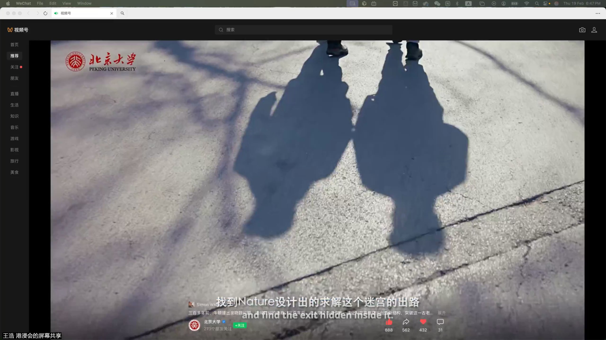

**屏幕可见UI元素** (OCR):
```
WeChat | File | Edit | Window | Thu 19 Feb 6.47PM | 视频号 | N 视频号 | Q 搜索 | 推荐 | 关注 | 朋友 | 直擂 | 生活 | 知识 | 音乐 | 游戏 | 影视 | 旅行 | 美食 | SIIOI
```

---

### 帧 37 [12:19]


**屏幕可见UI元素** (OCR):
```
WeChat | File | Edit | Window | Thu 19 Feb 6.47PM | N 视频号 | Q 搜索 | 推荐 | 关注 | 朋友 | 生活 | 知识 | 音乐 | 游戏 | 影视 | 旅行 | 美食 | Simon WANG | 为了能够跟大家产生一些跨学科的碰撞 | 三百多年前;
```

**讲师讲解要点**:
- [00:12:40] 我们发现在对 AI 产生的结构进行分解后，会出现大量具有较好几何特性的子结构。我们把这些子结构叫做碎片。当智能体每完成一轮矩阵填充游戏后，我们都会将这个矩阵打碎成大小不一的各种几何碎片，然后试图重组和继续填充这些碎片。这整个过程它就像不断的在进行细胞的分裂，不断产生更多新的数字生命。

---

### 帧 38 [12:39]

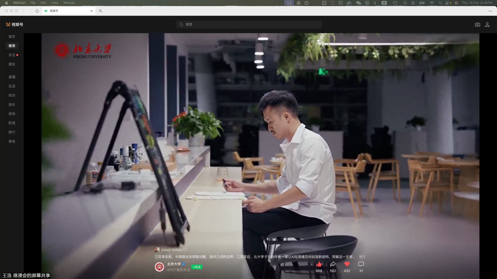

**屏幕可见UI元素** (OCR):
```
WeChat | File | Edit | Window | Thu 19 Feb 6.48PM | 视频号 | N 视频号 | Q 搜索 | 首页 | 推荐 | 关注 | 朋友 | 直播 | 生活 | 知识 | 音乐 | 游戏 | 影视 | 旅行 | 美食
```

**讲师讲解要点**:
- [00:12:40] 我们发现在对 AI 产生的结构进行分解后，会出现大量具有较好几何特性的子结构。我们把这些子结构叫做碎片。当智能体每完成一轮矩阵填充游戏后，我们都会将这个矩阵打碎成大小不一的各种几何碎片，然后试图重组和继续填充这些碎片。这整个过程它就像不断的在进行细胞的分裂，不断产生更多新的数字生命。
- [00:13:09] 在200多组实验中，突然冒出了一个非常奇怪的碎片，在对它进一步的分析和填充后，似乎产生了一些非常不一样的东西。我们需要重新写一些程序，大脑就是有点一片空白，我就打好几遍，把对角线元素抠掉，其元素都小于等于0.5。然后第二个算一下它的质是不是等于25的？然后就是估算一下它的最大的预算值是多少？

---

### 帧 39 [12:59]

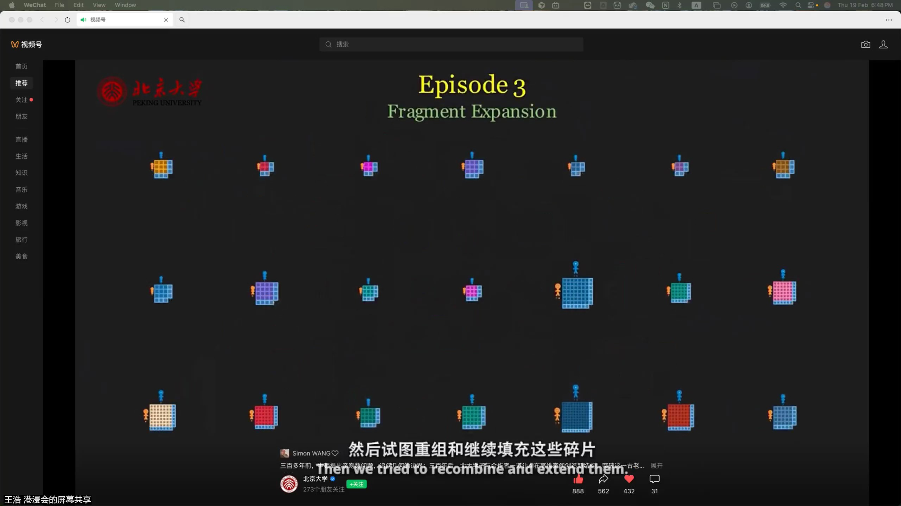

**屏幕可见UI元素** (OCR):
```
WeChat | File | Edit | Window | Thu 19 Feb 6.48PM | 视频号 | N 视频号 | Q 搜索 | 推荐 | Eisode3 | 关注 | 朋友 | Fragment Epansion | 生活 | 知识 | 音乐 | 游戏 | 影视 | 旅行 | 美食
```

**讲师讲解要点**:
- [00:12:40] 我们发现在对 AI 产生的结构进行分解后，会出现大量具有较好几何特性的子结构。我们把这些子结构叫做碎片。当智能体每完成一轮矩阵填充游戏后，我们都会将这个矩阵打碎成大小不一的各种几何碎片，然后试图重组和继续填充这些碎片。这整个过程它就像不断的在进行细胞的分裂，不断产生更多新的数字生命。
- [00:13:09] 在200多组实验中，突然冒出了一个非常奇怪的碎片，在对它进一步的分析和填充后，似乎产生了一些非常不一样的东西。我们需要重新写一些程序，大脑就是有点一片空白，我就打好几遍，把对角线元素抠掉，其元素都小于等于0.5。然后第二个算一下它的质是不是等于25的？然后就是估算一下它的最大的预算值是多少？

---

### 帧 40 [13:19]

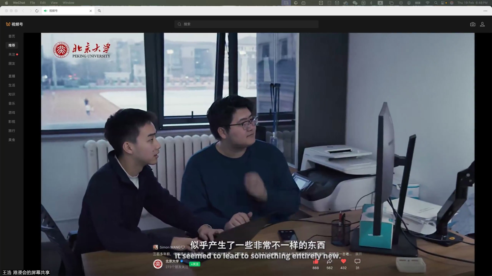

**屏幕可见UI元素** (OCR):
```
WeChat | File | Edit | Window | Thu 19 Feb 6.48PM | 视频号 | N 视频号 | Q 搜索 | 推荐 | 关注 | 朋友 | 生活 | 知识 | 音乐 | 游戏 | 影视 | 旅行 | 美食 | Simon WANGO | 似乎产生了一些非常不一样的东西
```

**讲师讲解要点**:
- [00:13:09] 在200多组实验中，突然冒出了一个非常奇怪的碎片，在对它进一步的分析和填充后，似乎产生了一些非常不一样的东西。我们需要重新写一些程序，大脑就是有点一片空白，我就打好几遍，把对角线元素抠掉，其元素都小于等于0.5。然后第二个算一下它的质是不是等于25的？然后就是估算一下它的最大的预算值是多少？
- [00:13:45] 太激动了，真的太激动了，我们终于突破了 low
- [00:13:45] 有点像是要把箭射到月亮上，这个问题本身的魅力就在于你在真的射出那一箭之前，你永远不知道这个箭会不会落位
- [00:13:45] 每个人都说我们这个项目最终肯定会完蛋
- [00:13:45] 但很幸运的是，我们真的做到了，所以当时就感觉好像像这个，现在突然突破了什么

---

### 帧 41 [13:39]

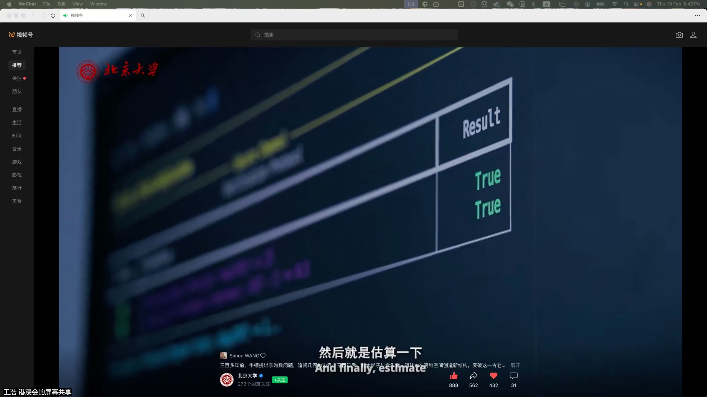

**屏幕可见UI元素** (OCR):
```
WeChat | File | Edit | Window | Thu 19 Feb 6.49PM | 视频号 | N 视频号 | 搜索 | 推荐 | 关注 | 朋友 | 生活 | 知识 | 音乐 | 游戏 | 影视 | 旅行 | 美食 | Simon WANGO | 然后就是估算-下
```

**讲师讲解要点**:
- [00:13:45] 太激动了，真的太激动了，我们终于突破了 low
- [00:13:45] 有点像是要把箭射到月亮上，这个问题本身的魅力就在于你在真的射出那一箭之前，你永远不知道这个箭会不会落位
- [00:13:45] 每个人都说我们这个项目最终肯定会完蛋
- [00:13:45] 但很幸运的是，我们真的做到了，所以当时就感觉好像像这个，现在突然突破了什么

---

### 帧 42 [13:59]

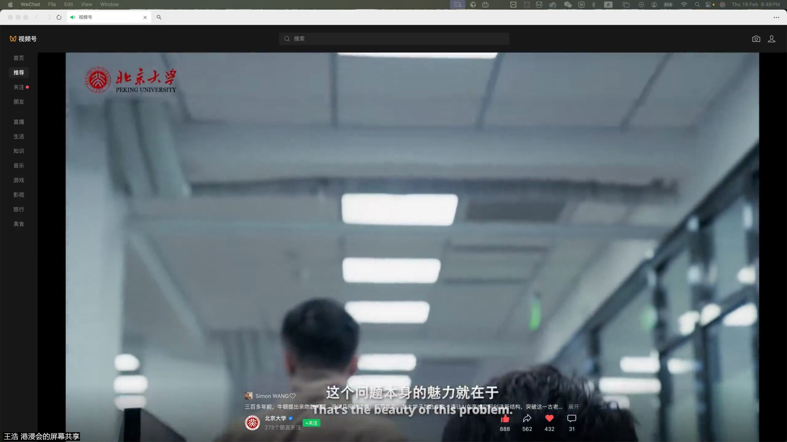

**屏幕可见UI元素** (OCR):
```
WeChat | File | Edit | Window | Thu 19 Feb 6.49PM | 视频号 | N 视频号 | Q 搜索 | 推荐 | 关注 | 朋友 | 生活 | 知识 | 音乐 | 游戏 | 影视 | 旅行 | 美食 | Simon WANGO | 三百多年前,
```

**讲师讲解要点**:
- [00:13:45] 太激动了，真的太激动了，我们终于突破了 low
- [00:13:45] 有点像是要把箭射到月亮上，这个问题本身的魅力就在于你在真的射出那一箭之前，你永远不知道这个箭会不会落位
- [00:13:45] 每个人都说我们这个项目最终肯定会完蛋
- [00:13:45] 但很幸运的是，我们真的做到了，所以当时就感觉好像像这个，现在突然突破了什么
- [00:14:30] 当然，我的目的是要通过自己手搓去打破一个 L 的。我其实也在与自己团队内部的机器在竞争，如果我做不到，但是机器做的话，那么确实这个东西它做到了比数学家更厉害的一点。结论就是这次打破了棒的呢，确实根本不是我人类能够说出来的。

---

### 帧 43 [14:19]

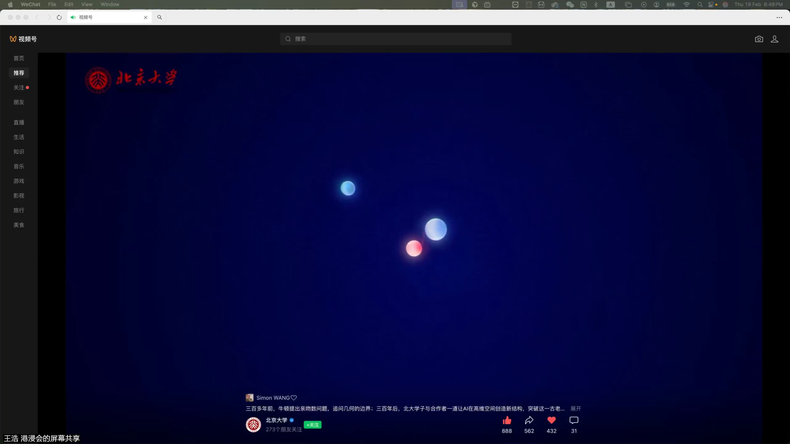

**屏幕可见UI元素** (OCR):
```
WeChat | File | Edit | Window | Thu 19 Feb 649PM | 视频号 | N 视频号 | Q 搜索 | 推荐 | 关注 | 朋友 | 直播 | 生活 | 知识 | 音乐 | 游戏 | 影视 | 旅行 | 美食 | Simon WANGO
```

**屏幕文本内容** (OCR):
- 三百多年前。牛顿提出亲吻数问题。追问几何的边界;  三百年后。北大学子与合作者一道让A1在高维空间创造新结构;突破这一古老.

**讲师讲解要点**:
- [00:14:30] 当然，我的目的是要通过自己手搓去打破一个 L 的。我其实也在与自己团队内部的机器在竞争，如果我做不到，但是机器做的话，那么确实这个东西它做到了比数学家更厉害的一点。结论就是这次打破了棒的呢，确实根本不是我人类能够说出来的。
- [00:14:57] 后面越来越多的发现了一些反直觉的现象，比如一些很漂亮的结构当中，每个球它都没有对进球，但却保持了极高的对称性。更有意思的是，它像在宇宙中架起引力通道一样，把原本散落在不同维度中的几何孤立星。彼此的连通让我们也让数学家们可以从更宏观，更系统的视角去重新理解这个问题。

---

### 帧 44 [14:39]

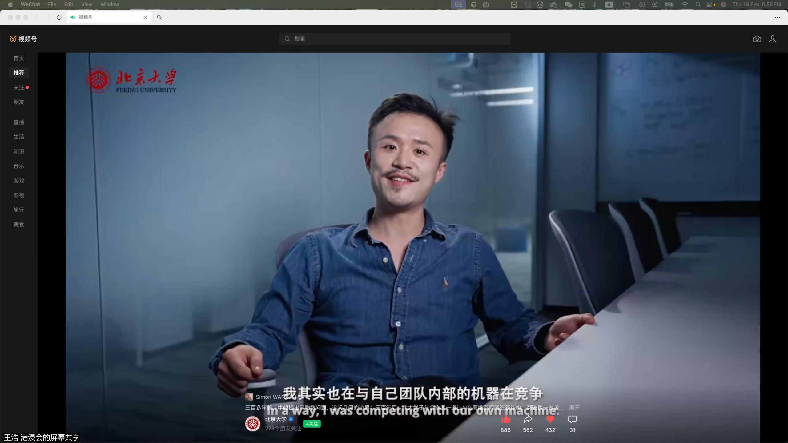

**屏幕可见UI元素** (OCR):
```
Wechat | File | Edit | Window | Thu 19 Feb 6:50PM | N 视频号 | Q 搜索 | 推荐 | 关注 | 朋友 | 直插 | 生活 | 知识 | 音乐 | 游戏 | 影视 | 旅行 | 美食 | Simon WAN | 展开
```

**讲师讲解要点**:
- [00:14:30] 当然，我的目的是要通过自己手搓去打破一个 L 的。我其实也在与自己团队内部的机器在竞争，如果我做不到，但是机器做的话，那么确实这个东西它做到了比数学家更厉害的一点。结论就是这次打破了棒的呢，确实根本不是我人类能够说出来的。
- [00:14:57] 后面越来越多的发现了一些反直觉的现象，比如一些很漂亮的结构当中，每个球它都没有对进球，但却保持了极高的对称性。更有意思的是，它像在宇宙中架起引力通道一样，把原本散落在不同维度中的几何孤立星。彼此的连通让我们也让数学家们可以从更宏观，更系统的视角去重新理解这个问题。

---

### 帧 45 [14:59]

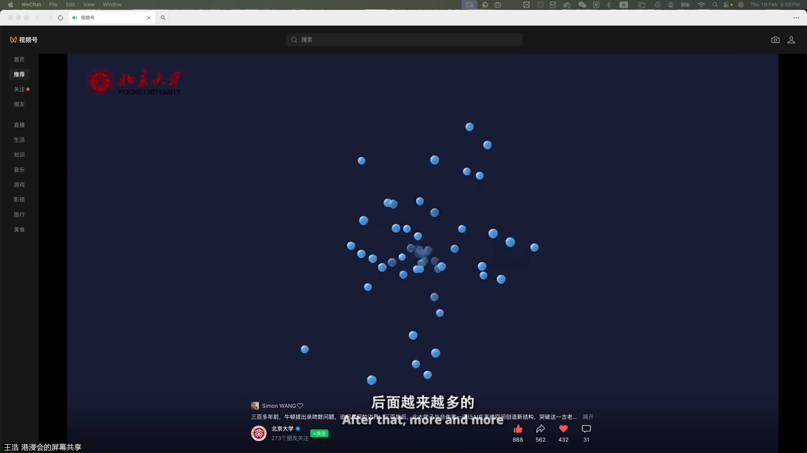

**屏幕可见UI元素** (OCR):
```
Wechat | File | Edit | Window | Thu 19 Feb 6:50PM | N 视频号 | 搜索 | 推荐 | 关注 | 朋友 | 生活 | 知识 | 音乐 | 游戏 | 影视 | 旅行 | 美食 | Simon WANGO | 后面越来越多的 | 三百多年前。牛顿提出亲吻数问题,
```

**讲师讲解要点**:
- [00:14:30] 当然，我的目的是要通过自己手搓去打破一个 L 的。我其实也在与自己团队内部的机器在竞争，如果我做不到，但是机器做的话，那么确实这个东西它做到了比数学家更厉害的一点。结论就是这次打破了棒的呢，确实根本不是我人类能够说出来的。
- [00:14:57] 后面越来越多的发现了一些反直觉的现象，比如一些很漂亮的结构当中，每个球它都没有对进球，但却保持了极高的对称性。更有意思的是，它像在宇宙中架起引力通道一样，把原本散落在不同维度中的几何孤立星。彼此的连通让我们也让数学家们可以从更宏观，更系统的视角去重新理解这个问题。
- [00:15:22] 我觉得我花了最多时间的工作，就是我去尝试解读。AI 这个黑箱带给我的这个数据。英文中有一个很好的词，可以描述我的工作，叫做它在古希腊里叫做解释神。AI 作为一个黑箱子，他就告诉你说，我比人类我比之前做到的所有值都更优，那么我们到底去怎么样去解读这个 AI 给我们这样子的灵感。

---

### 帧 46 [15:19]

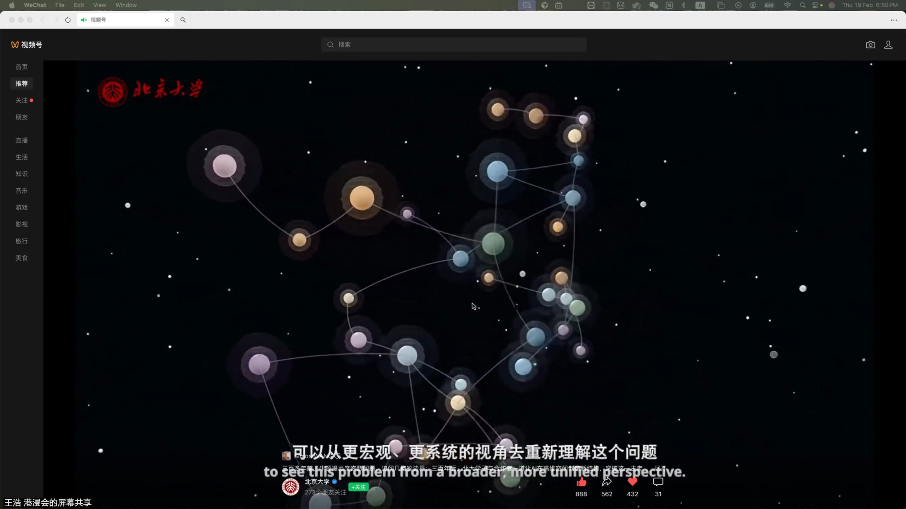

**屏幕可见UI元素** (OCR):
```
Wechat | File | Edit | Window | Thu 19 Feb 6.50PM | 视频号 | N 视频号 | Q 搜索 | 推荐 | 关注 | 朋友 | 直播 | 生活 | 知识 | 音乐 | 游戏 | 影视 | 旅行 | 美食 | 更系统酌视角去重新理解这个问题
```

**讲师讲解要点**:
- [00:14:57] 后面越来越多的发现了一些反直觉的现象，比如一些很漂亮的结构当中，每个球它都没有对进球，但却保持了极高的对称性。更有意思的是，它像在宇宙中架起引力通道一样，把原本散落在不同维度中的几何孤立星。彼此的连通让我们也让数学家们可以从更宏观，更系统的视角去重新理解这个问题。
- [00:15:22] 我觉得我花了最多时间的工作，就是我去尝试解读。AI 这个黑箱带给我的这个数据。英文中有一个很好的词，可以描述我的工作，叫做它在古希腊里叫做解释神。AI 作为一个黑箱子，他就告诉你说，我比人类我比之前做到的所有值都更优，那么我们到底去怎么样去解读这个 AI 给我们这样子的灵感。
- [00:15:53] 因为我觉得这个工作非常苦，其实就六个非常年轻的这个同学完成背后就是这些基础学科加人工智能的这个教。所以我觉得我们中国的学者，尤其是年轻的这一代的这个人，真的特别厉害，人工智能在这个过程中扮演的角色就。帮助这些年轻科学家，让他们能够更高效的探索未知的宇宙，这本身就是一种人类和机器，共同探索科学的浪漫。

---

### 帧 47 [15:39]

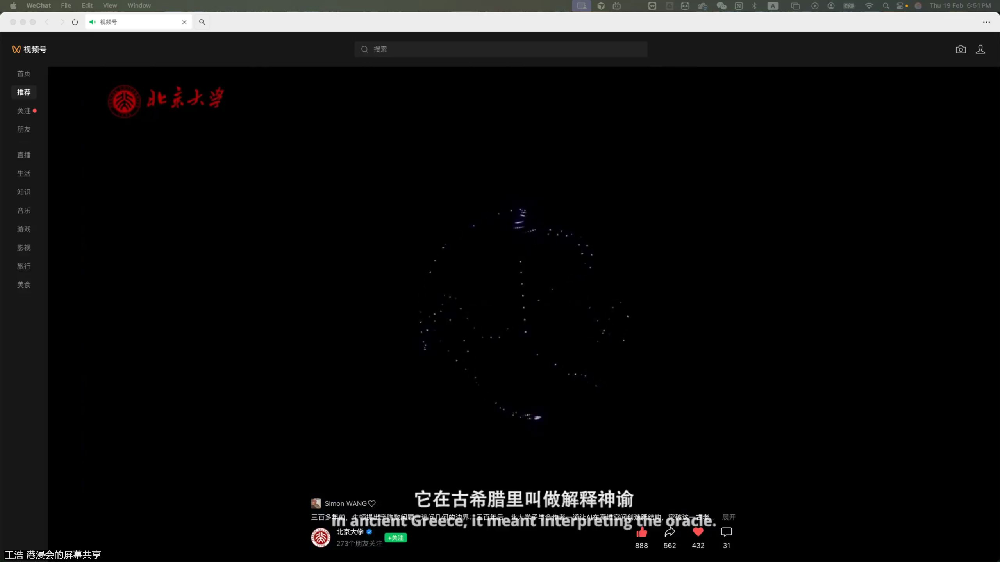

**屏幕可见UI元素** (OCR):
```
Wechat | File | Edit | Window | Thu 19 Feb 6.51PM | 视频号 | N 视频号 | Q 搜索 | 推荐 | 关注 | 朋友 | 直播 | 生活 | 知识 | 音乐 | 游戏 | 影视 | 旅行 | 美食 | Simon WANGO
```

**讲师讲解要点**:
- [00:15:22] 我觉得我花了最多时间的工作，就是我去尝试解读。AI 这个黑箱带给我的这个数据。英文中有一个很好的词，可以描述我的工作，叫做它在古希腊里叫做解释神。AI 作为一个黑箱子，他就告诉你说，我比人类我比之前做到的所有值都更优，那么我们到底去怎么样去解读这个 AI 给我们这样子的灵感。
- [00:15:53] 因为我觉得这个工作非常苦，其实就六个非常年轻的这个同学完成背后就是这些基础学科加人工智能的这个教。所以我觉得我们中国的学者，尤其是年轻的这一代的这个人，真的特别厉害，人工智能在这个过程中扮演的角色就。帮助这些年轻科学家，让他们能够更高效的探索未知的宇宙，这本身就是一种人类和机器，共同探索科学的浪漫。

---

### 帧 48 [15:59]

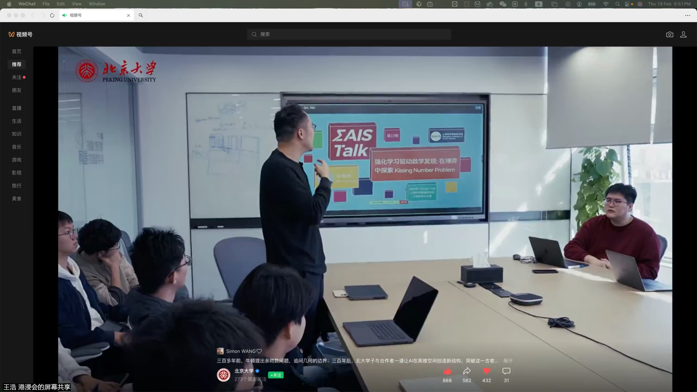

**屏幕可见UI元素** (OCR):
```
Wechat | File | Edit | Vew | Window | Thu 19 Feb 6:51PM | 视频号 | N 视频号 | Q 搜索 | 推荐 | 关注 | PLKIGUILRSII) | 朋友 | 生活 | 知识 | 音乐 | 7a1k | 游戏 | 影视 | 旅行
```

**屏幕文本内容** (OCR):
- 三百多年前。牛顿提出亲吻数问题。追问几何的边界;  三百年后
- 北大学子与合作者一道让41在高维空间创造新结构。突破这一古老。

**讲师讲解要点**:
- [00:15:53] 因为我觉得这个工作非常苦，其实就六个非常年轻的这个同学完成背后就是这些基础学科加人工智能的这个教。所以我觉得我们中国的学者，尤其是年轻的这一代的这个人，真的特别厉害，人工智能在这个过程中扮演的角色就。帮助这些年轻科学家，让他们能够更高效的探索未知的宇宙，这本身就是一种人类和机器，共同探索科学的浪漫。
- [00:16:21] 过去这一年多，每天都是算法结构，数字在跟他们较劲，这条路感觉又黑又长，望不到边，但真正突破以后，好像眼前一下亮了起来，似乎还有一片更开阔的星空在等着我们。packing star 就是载着我们探索这片星空的飞船，这也不是抵达，而是一次全新的开始。packing star 就是载着我们探索这片星空的飞船，这也不是抵达，而是一次全新的开始。

---

### 帧 49 [16:19]

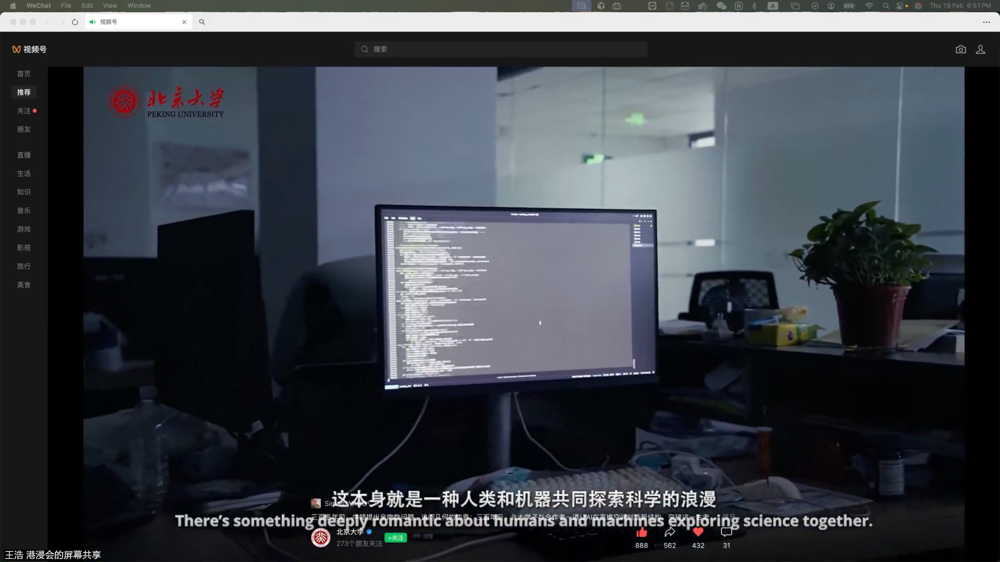

**屏幕可见UI元素** (OCR):
```
Wechat | File | Edit | Window | Thu 19 Feb 6:51PM | 视频号 | N 视频号 | Q 搜索 | 推荐 | 关注 | 朋友 | 生活 | 知识 | 音乐 | 游戏 | 影视 | 旅行 | 美食 | s本身就是一种人类和机器共同探索科学的浪漫 | +夫注
```

**讲师讲解要点**:
- [00:15:53] 因为我觉得这个工作非常苦，其实就六个非常年轻的这个同学完成背后就是这些基础学科加人工智能的这个教。所以我觉得我们中国的学者，尤其是年轻的这一代的这个人，真的特别厉害，人工智能在这个过程中扮演的角色就。帮助这些年轻科学家，让他们能够更高效的探索未知的宇宙，这本身就是一种人类和机器，共同探索科学的浪漫。
- [00:16:21] 过去这一年多，每天都是算法结构，数字在跟他们较劲，这条路感觉又黑又长，望不到边，但真正突破以后，好像眼前一下亮了起来，似乎还有一片更开阔的星空在等着我们。packing star 就是载着我们探索这片星空的飞船，这也不是抵达，而是一次全新的开始。packing star 就是载着我们探索这片星空的飞船，这也不是抵达，而是一次全新的开始。

---

### 帧 50 [16:39]

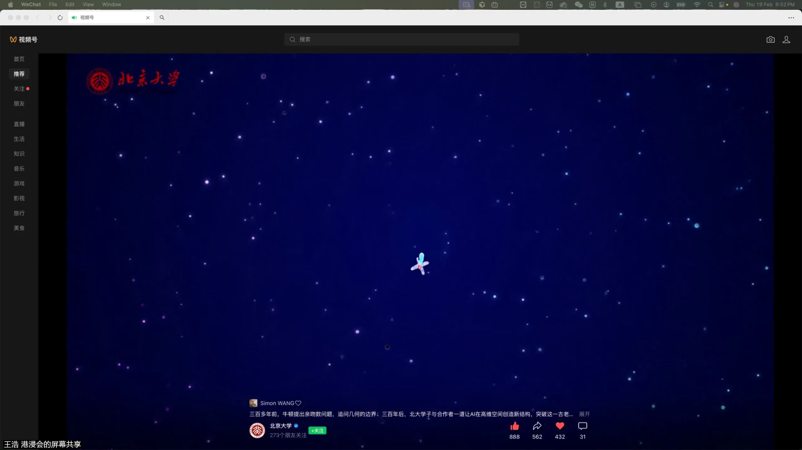

**屏幕可见UI元素** (OCR):
```
Wechat | File | Edit | Window | Thu 19 Feb 6.52PM | 视频号 | N 视频号 | Q 搜索 | 推荐 | 关注 | 朋友 | 生活 | 知识 | 音乐 | 游戏 | 影视 | 旅行 | 美食 | Simon WANGO | 展开
```

**屏幕文本内容** (OCR):
- 三百多年前。牛顿提出亲吻数问题。追问几何的边界;  三百年后。北大学子与合作者一道让41在高维空间创造新结构。突破这一古老。

**讲师讲解要点**:
- [00:16:21] 过去这一年多，每天都是算法结构，数字在跟他们较劲，这条路感觉又黑又长，望不到边，但真正突破以后，好像眼前一下亮了起来，似乎还有一片更开阔的星空在等着我们。packing star 就是载着我们探索这片星空的飞船，这也不是抵达，而是一次全新的开始。packing star 就是载着我们探索这片星空的飞船，这也不是抵达，而是一次全新的开始。

---

### 帧 51 [16:59]


---

## Q&A 摘要

- [00:00:13] 直到看到了那堆球。于是开始不断的想象，超越真实世界的维度是什么样的？也感受到了他有多困难？但也正是从那一刻起。我们仿佛有了能力去创造一个新的数字生命。在三维空间中，你可以想象一个16它是一个多面积的石榴子，排在一起，把石榴子换成圆球，最多可以有多少个单位球和它相接，那就变成了300多年前牛顿提出来的...
- [00:01:03] 1900年的时候，希尔伯特在巴黎国际数学家大会上正式提出了23个问题，这些问题指引了后世数学研究的重要方向。其中第18个问题的核心之一就是 key number 问题。这个问题呢，其实非常简洁，但又非常深刻。同时有很多的应用价值，在信息编码中，你想用最少的比特数来压缩最多的信息，这就是 case n...
- [00:01:48] 当我们聊到2022年菲尔兹奖，由数学家取得一些特殊维度上的装求问题突破的过程中，我们就在思考，除了数学家从数学的角度在某些维度上的突破，我们能否把课题组前期在多智能体学习，强化学习上的成功带到数学领域。
- [00:02:05] 真正的能够让人类在基础数学问题上有一些新的认知，新的发现数学问题并没有大量的训练数据，那这个呢和利用大量的已知的蛋白质的结构训练一个人工智能模型来预测新的蛋白质结构是不一样的，某种角度是无中生有的过程。
- [00:02:56] 我们采取了跟数学家完全不同的思路，从最基本的约束和前提出发，接下一个球可以放在哪个位置，相当于就是把填空题变成了选择题。之前我们发现连四维都搞不定，一下子八维以下全部都被搞定了。然后后来很快我们发现，不管再怎么样优化这个方案，它都有一些注定无法被解决的限制，比如说舒适精度上的问题，误差会随着球数越来...
- [00:03:28] 我们被困在了九围八围这个附近，再高根本是完全没有办法再达到了。在一个球面上有这样两个球的时候，他们在原点之间就形成了一个连线，两两之间都可以计算一个角度的余弦值。这个余弦值并不是一个没有规矩的存在。他们其实在一个有限的集合里，我们就不只是把整个坐标空间变成一个第三选择题，我们可以把每一个 cos 值...
- [00:04:50] 我们仍然需要寻找到最高效的学习算法。我们的思路是把它设计成一个游戏，用强化学习来训练智能题去玩这个游戏。它在每一步都需要从待选的动作集合中去选取一个条目来填充这个矩阵，直到整个矩阵无法再被填充。这个游戏就结束了，我们根据当前矩阵大小来对智能体进行奖励，那么这个问题的属性呢？我们认为就非常适合使用强化...
- [00:08:48] 但是随着进一步的实验以后就发现，虽然现在扩展能力上去了，但是实验上就是跑不出那个结果，当时遇到的最大问题就是14维，我们就是没有办法复原1932。千百次数万次的实验之后全部都是失败的。这个14位的1932就像一个梦魇一样，一直缠绕了半年多的时间。我甚至会做梦，梦到有1700多，但是全部都是幻觉，这是...
- [00:10:37] 这两个智能体呢？需要达成合作，通过合作博弈的方式来求解一个非常复杂的岗位空间的巡游问题，这也是这个工作最巧妙的地方，就是陈栋把一个稳求问题转化成了一个博弈问题，并且这个博弈。问题可以用强化学习来调节 second player ，相当于为原本巨大且无序的高危空间添加了一种正则约束，从而显著的压缩的搜...
- [00:13:45] 太激动了，真的太激动了，我们终于突破了 low！有点像是要把箭射到月亮上，这个问题本身的魅力就在于你在真的射出那一箭之前，你永远不知道这个箭会不会落位。每个人都说我们这个项目最终肯定会完蛋。但很幸运的是，我们真的做到了，所以当时就感觉好像像这个，现在突然突破了什么。第一，第二，宇宙速度一样，就真的是...
- [00:14:57] 后面越来越多的发现了一些反直觉的现象，比如一些很漂亮的结构当中，每个球它都没有对进球，但却保持了极高的对称性。更有意思的是，它像在宇宙中架起引力通道一样，把原本散落在不同维度中的几何孤立星。彼此的连通让我们也让数学家们可以从更宏观，更系统的视角去重新理解这个问题。

---

## 处理管线信息

- 关键帧提取: 每20秒采样, perceptual hash去重 (threshold=8)
- 总提取帧数: 51 (去重后)
- OCR引擎: easyocr (Chinese Simplified + English)
- 转录来源: PKU_wechat.txt
- 对齐策略: 每帧前后30-40秒内转录段落匹配

---

## Appendix: Key Diagrams in the Video (English Explanation)

The video contains several technical diagrams shown on screen. Below is an explanation of each, matched to the keyframe where it appears.

### Diagram 1 — Kissing number structures in low dimensions (帧 6, ~01:39)

**On screen:** "Petrie projection", "3D perspective", "rhombic triacontahedron"

**What it shows:** Visual representations of known kissing number configurations. The **rhombic triacontahedron** is the polyhedron formed by the 12 points where balls touch the centre in 3D (the answer to Newton's question). The **Petrie projection** is a way to "flatten" higher-dimensional structures into 2D drawings while preserving some symmetry. These diagrams set the stage: the problem is easy to visualise in 3D, but becomes abstract in higher dimensions.

---

### Diagram 2 — Known kissing number chart (帧 10, ~03:19)

**On screen:** Numbers 306, 240, 300, 200, 126

**What it shows:** A chart or table of known (best) kissing numbers in various dimensions. These match well-known values: K(8)=240, K(7)=126, etc. The speaker is explaining that progress has been extremely slow — only ~7 advances in 50 years — and each required a completely different mathematical method. This diagram motivates why AI was needed.

---

### Diagram 3 — Single-agent matrix completion game (帧 15, ~04:59)

**On screen:** "Filler: Matrix Completion", "Action Space"

**What it shows:** The first version of PackingStar's approach — a single agent (the "Filler") plays a matrix completion game. At each step, it selects a cosine value from the action space and fills one entry in the Gram matrix. The game ends when no more valid entries can be added. The reward = matrix size (number of spheres). This is the foundation before the two-player design was introduced.

---

### Diagram 4 — Multi-entry completion (帧 18, ~05:59)

**On screen:** "Multi-Entry Completion", "Action Space"

**What it shows:** An optimisation of the game where the agent can fill **multiple matrix entries at once** instead of one at a time. This dramatically improves trajectory efficiency — adding balls one-by-one creates many equivalent orderings (ABC = BCA), wasting exploration. Batch filling avoids this redundancy.

---

### Diagram 5 — Target kissing numbers (帧 19, ~06:19)

**On screen:** Numbers 2564, 1932, 1154

**What it shows:** The known kissing numbers the team was trying to **reproduce** before claiming new ones: K(15)=2564, K(14)=1932, K(13)=1154. Reproducing these was a key validation step — if PackingStar could not match what mathematicians had already achieved, it could not be trusted to find new results.

---

### Diagram 6 — Engineering: GPU optimisation (帧 21–24, ~06:59–07:59)

**On screen:** "Number Problem 中的挑战" (Challenges in Kissing Number Problem), "Episode 1", "Pre cached Actions"

**What it shows:** The engineering challenges and solutions. The team rewrote GPU kernels to keep data on-GPU (avoiding CPU round-trips), designed mixed-precision arithmetic, and pre-cached frequently used actions. Speaker 程远 (Yuan Cheng, Fudan/SAIS) explains that "computation and intelligence are inseparable" — faster search = smarter system.

---

### Diagram 7 — Checkpoint mechanism (帧 25, ~08:19)

**On screen:** "Without Checkpoints" vs. "With Checkpoints"; "Save state periodically. Recover from last checkpoint"

**What it shows:** A before/after diagram. Without checkpoints, a cluster crash means restarting from scratch. With checkpoints (saving state periodically), the system recovers from the last saved point. This allowed uninterrupted deep search across days, essential for scaling to 30+ dimensions.

---

### Diagram 8 — The 14D nightmare: progress chart (帧 27–28, ~08:59–09:19)

**On screen:** 2564, 1932 (帧 27); 1528, 1551, 1587 with "Kissing Number" labels (帧 28)

**What it shows:** The team's struggle to reproduce K(14)=1932. After thousands of experiments, the system could only reach ~1700 (the researcher even dreamed of 1700+). The chart likely shows successive runs climbing from 1528 → 1551 → 1587 but falling short of 1932. This "nightmare" lasted 6+ months and was only resolved by introducing the second agent (Corrector).

---

### Diagram 9 — PackingStar system overview (帧 31, ~10:19)

**On screen:** "PackingStar 系统"

**What it shows:** The complete system architecture. This is the top-level diagram showing how all components fit together.

---

### Diagram 10 — Two-Player Matrix Completion Game (帧 32–33, ~10:39–10:59)

**On screen:** "Two-Player Matrix Completion Game", "Filler", "Action Space", "Lv2"

**What it shows:** The final and key design innovation. Two agents cooperate:
- **Filler (Player 1):** Adds cosine values to the matrix (places balls).
- **Corrector (Player 2):** Removes bad entries that would "poison" the structure ("一个老鼠害一锅汤" — one bad apple spoils the barrel).

The "Lv2" label suggests a levelled/hierarchical game structure. This design was inspired by the mathematician's instinct to manually delete bad balls, and it immediately solved the 14D problem (reaching 1932). It acts as a regularisation constraint on the search space.

---

### Diagram 11 — Leech lattice: 196,560 (帧 34, ~11:19)

**On screen:** Number 196560

**What it shows:** The kissing number in 24 dimensions, K(24) = 196,560. This is the Leech lattice, one of the most famous structures in mathematics. PackingStar uses subsets of Leech lattice vectors as building blocks for dimensions 25–31. The number is highlighted to show the scale of the problem at high dimensions.

---

### Diagram 12 — Fragment Expansion (帧 39, ~12:59)

**On screen:** "Episode 3", "Fragment Expansion"

**What it shows:** The fragment decomposition mechanism. After each game round, the resulting matrix is broken into smaller sub-structures ("fragments" / 碎片). These fragments are then recombined and used as seeds for new games — "like cell division, constantly producing new digital life." It was during this process that a strange fragment in the 200th experiment led to the 25D breakthrough.